# E3D PML Form Designer

AVEVA E3D の PML ユーザーフォームを視覚的に設計する、日本語 UI の PySide6 デスクトップアプリです。E3D 4.0 を想定していますが、E3D 実機での構文・表示・文字コードの互換性は未検証です。E3D 本体やライセンスは含みません。

## UI

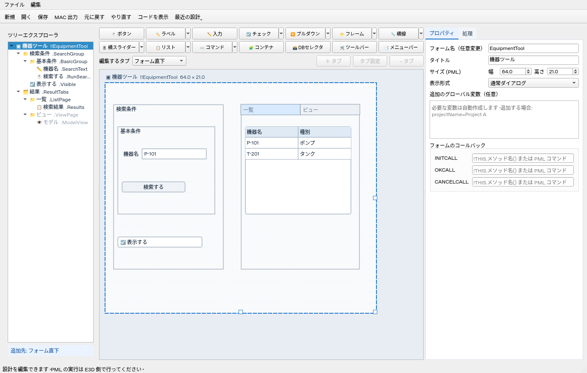

基本操作は同梱の [USER_GUIDE.txt](USER_GUIDE.txt) にまとめています。
背景透過のシルバー・シアンのアイコンはZIP直下に [app-icon.png](app-icon.png) / [app-icon.ico](app-icon.ico) を同梱し、ウィンドウ用にも `e3d_designer/assets` に収録しています。`build_onedir.ps1` でアイコン付きのEXEをビルドできます。

## 起動 (Windows)

Python 3.12 をインストールして、このディレクトリで実行します。

```powershell
py -3.12 -m venv .venv
.\.venv\Scripts\python.exe -m pip install -r requirements.txt
.\.venv\Scripts\python.exe -m e3d_designer
```

Linux では `python3 -m venv .venv`、`.venv/bin/python -m pip install -r requirements.txt`、`.venv/bin/python -m e3d_designer` を使用します。画面操作にはデスクトップ環境が必要です。

Windowsで `onedir` 形式のEXEを作成するコマンドは、同梱の [EXE_BUILD_ONEDIR.txt](EXE_BUILD_ONEDIR.txt) に記載しています。PyInstallerの起動ファイルには `run_designer.py` を使います。配布時は `dist/E3DFormDesigner` フォルダー全体を含めてください。

## 作業の流れ

キャンバスを常時表示し、部品の追加・選択・配置・プロパティ編集を同じ画面で行います。上部の作業順ボタンとキャンバス／コード切り替えタブはありません。「コードを表示」（Ctrl+Shift+C）で生成コード・保存状態・チェック結果・出力先を別ウィンドウに開きます。コードウィンドウを開いてもメイン画面の配置は変わらず、編集内容はコードに反映されます。

新規フォームの名前・表示形式は設定済みです。部品を追加すると部品名と、操作可能な部品の処理メソッド名を重複しない名前で設定します。名前を編集せずに配置・保存・MAC出力ができます。名前欄は、管理しやすい名前へ変えたい場合だけ編集してください。リストの配列・設定メソッド、外部マクロの分岐変数・値も必要に応じて自動作成します。追加のグローバル変数・ローカル変数は任意です。

自動設定した処理メソッドの初期内容はコメントだけです。必要な業務処理は「処理コードを編集」から追加し、右側に表示する対象部品と処理名で確認します。CALLコマンドを入力した場合はメソッド指定を解除し、メソッド名を設定し直した場合はCALLコマンドを解除します。切り替えはUndoで戻せます。画像・外部マクロ・DLL等の使用時には、その実際のファイルや必要な動作の指定が必要です。

ツールバーには新規・開く・保存・MAC出力・Undo/Redo・コード表示・最近の設計を配置し、別名保存・作業の復元は「ファイル」、複製・削除・名前管理は「編集」メニューへまとめています。既存のショートカットは維持します。

[編集画面](docs/current-ui/form-canvas.png) / [別ウィンドウのコード表示](docs/current-ui/separate-code.png)

## 使い方

追加ボタンはキャンバス列の上部に14個の絵文字付きボタンで表示します。関連する部品は矢印のメニューで種類を選び、ボタン本体で選択した種類を繰り返し追加できます。ラベル／画像、チェック／ラジオ、プルダウン／コンボ／画像選択、フレーム／タブ、横線／縦線、横／縦スライダー、リスト／複数行、コマンド／ビューをまとめています。キャンバスの幅に合わせて折り返し、ツリーとプロパティは上端から表示します。追加したメニューバーのプレビューは枠で囲みます。

通常幅でのボタンの順序は次のとおりです。メニューバーのプレビューはダブルクリックでも編集画面を開けます。

| 行 | 左からの順序 |
| --- | --- |
| 1 | ボタン、プルダウン、フレーム、チェック、横線、メニューバー、コンテナ |
| 2 | 入力、ラベル、リスト、スライダー、コマンド、DBセレクタ、ツールバー |

1. 上部のボタンで部品を追加し、キャンバスをドラッグして配置します。変更できる寸法にだけサイズ変更ハンドルを表示します。画像はサイズ固定、文字PARAGRAPHとTEXTは横幅、線とスライダーは長さだけを変更できます。
2. 右の「プロパティ」で表示文字、座標、サイズを変更します。キャンバスまたは部品一覧のダブルクリックでミニ編集画面を開けます。線・スライダーの向きも変更できます。数値は PML レイアウト単位です。
3. キャンバスのフォーム枠を選ぶと、右の「プロパティ」でフォーム全体の名前・タイトル・サイズとグローバル／ローカル変数を設定できます。枠の右・下・右下のハンドルでサイズを変更し、枠の見出しをダブルクリックするとミニ設定画面を開けます。表示形式は「通常ダイアログ、右、左、上、下、MAIN」の順で、新規フォームは通常ダイアログがデフォルトです。変数は `equipmentValue=P-101` のように1行1変数で記述します。`名前=値`／`!!名前=値` はグローバル、`!名前=値` はローカルです。Enterで末尾にも改行でき、空行・入力中のカーソル位置を保持します。空行は宣言へ変換しません。ローカル変数はフォーム定義前に `VAR !名前 '値'` を出力し、メソッド内のローカル変数はそのメソッドで別途宣言してください。
4. TEXT の型・初期値、OPTION / LIST の選択肢を指定します。OPTION のコマンド欄は選択肢と同じ行順です。
5. BUTTON / TEXT / TOGGLE に CALL コマンド、またはメソッド名を設定します。メソッド名を指定した場合はその処理コードを編集できます。両方は同時指定できません。
6. 右の「処理」タブでDEFAULT メソッドの処理と「表示後のプログラム」を必要に応じて記述します。
7. 「保存」で JSON 設計を保存し、「ファイル → 名前を付けて保存」（Ctrl+Shift+S）で別名の設計を作れます。「MAC 出力」で `.mac` を生成します。文字コードはSJIS（CP932）です。

数値入力欄は小数点以下1桁で表示し、スピンボタンは0.1ずつ増減します。読み込んだ数値の細かい桁は、その欄を変更するまで保持します。画像の幅・高さも同じ設定です。ハンドルでのサイズ変更は0.5 PML単位で、最小値は1です。親領域を超える変更や、FRAME内の子部品をはみ出させる縮小は受け付けません。参照先のサイズを変えると、相対配置・幅参照のプレビューも追従します。幅を参照している部品では高さのハンドルだけを表示します。ドラッグ1回をUndoで戻せます。高さなどがPML構文に含まれない部品では、変更はプレビュー用です。

選択中のサイズハンドルは、重なった子部品より優先して操作できます。TABSETのタブFRAMEやフォーム全面のFRAMEが重なっていても、幅・高さ・右下のハンドルでサイズを変更できます。

[階層サンプル](examples/tree-explorer.json)を開くと、入れ子のFRAMEとTABSETを試せます。左側はツリーエクスプローラです。フォームをルートとして、FRAMEをフォルダ、TABSETをその親フォルダ、タブのFRAMEを子フォルダとして表示します。通常の部品は所属フレームの下に並びます。フォルダの矢印で展開・折りたたみ、選択でキャンバスとプロパティを同期します。別タブの部品を選ぶと対応ページへ切り替わります。フォームを選んで追加するとフォーム直下、フレームやその部品を選んで追加するとそのフレーム内へ追加します。

タブ見出しはクリックでページを切り替え、ドラッグでTABSET全体を移動できます。ドラッグ中から各タブのFRAMEと部品が追従し、非表示ページも同じ位置へ移動します。子部品の内部座標は保持します。Escで移動を取り消し、確定した移動は1回のUndoで戻せます。

ツリーのドラッグで同じ親の順序を変え、フレームへドロップして所属を変えられます。新しい親の領域内に座標を取り直し、子部品の位置は保持します。自分・子孫への移動やサイズが収まらない移動を拒否します。タブページは同じTABSET内の並び替えに対応します。Undo／Redoと保存に対応し、AUTO配置が並び替え後に成立しない場合は出力エラーを表示します。

キャンバスではCtrlまたはShiftを押しながらクリックすると選択を追加・解除できます。ツリーでもCtrlで複数選択、Shiftで範囲選択できます。FRAMEをキャンバスまたはツリーで右クリックし「子を含めてすべて選択」を選ぶと、FRAME自身と入れ子の子部品を選択します。TABSETでは非表示のタブとその部品も対象になり、タブのFRAMEではそのページ内だけを選択します。キャンバスとツリーの選択は同期し、複数選択中は右側の設定を灰色にして編集を無効にします。

選択の追加・解除でも非表示タブの選択を保持します。名前管理でリネームしても複数選択と表示中のタブを維持します。新規・設計の読み込み・作業の復元では前の選択とタブの表示状態をリセットします。

キャンバスにフォーカスがあるとき、矢印キーで0.5、Alt＋矢印キーで0.1単位移動します。複数選択はキーまたはドラッグでまとめて移動し、Deleteでまとめて削除できます。親と子を選択した移動では親だけの座標を変え、子の内部座標を保持します。移動先でも所属を保持し、領域を超える移動は全体を取り消します。1回の操作を1回のUndoで戻せます。相対配置・AUTO配置・ツールバー内の部品・タブページFRAME自身の座標は固定です。コピー・複製・ツリーの所属変更は1個を選択して行います。

[子を含めた複数選択の画面](docs/current-ui/multiple-selection.png)

## 最近の設計と未保存作業の復元

上部の「最近の設計」から、最近開いた・保存したJSONを最大10件選べます。パスはマウスを重ねると確認でき、履歴を消去しても設計ファイルは削除しません。出力先と一緒に `settings.json` へ保存します。

未保存の変更がある間は30秒ごとに、アプリと同じ場所の `recovery` フォルダへセッション別のバックアップを保存します。元のJSONには書き込みません。次の起動時に残った作業の復元を案内し、断っても「ファイル → 作業を復元」から選べます。別の起動中のアプリが使用している作業は候補に出しません。

復元後は未保存状態になるため、内容を確認して「保存」または「名前を付けて保存」を行ってください。保存・明示的な破棄で、その作業のバックアップを削除します。復元前のUndo履歴は復元しません。変数欄の入力途中の文字も保持しますが、モデルの入力エラーで保存できない場合は最後に成功したバックアップを保持し、ステータスへ通知します。30秒以内の直近の変更や、バックアップ先に書き込めない場合の変更は保護できません。

## コンパクトな設定欄

左側に現在の追加先、右側に選択部品の種類・名前・所属を表示します。ツリーはアイコン付きで、別のタブに属する部品を薄い文字色で区別します。長い名前は省略表示し、マウスを重ねると名前と親を確認できます。

右側は「プロパティ」「処理」の2タブです。プロパティは選択対象に応じてフォーム設定と部品設定を切り替えます。部品設定はさらに「基本」「配置」「内容」「動作」に分け、パネル全体のスクロールをなくしました。選択部品に設定項目がないタブは無効にし、空のページを開いたままにしません。初期値・座標欄には補足のツールチップがあります。選択肢・コード・表など、内容が長い入力欄の内部スクロールは使用できます。

キャンバスまたはツリーの部品をダブルクリックすると、その部品用のミニ設定画面が開きます。オブジェクト名・表示名・値・コマンド・色・サイズのうち対応する項目を編集でき、OPTION／COMBO／LISTの値はさらに表編集で設定できます。フォームのルートをダブルクリックするとフォーム設定を開きます。名前変更は参照も更新し、確定・キャンセル・Undoに対応します。

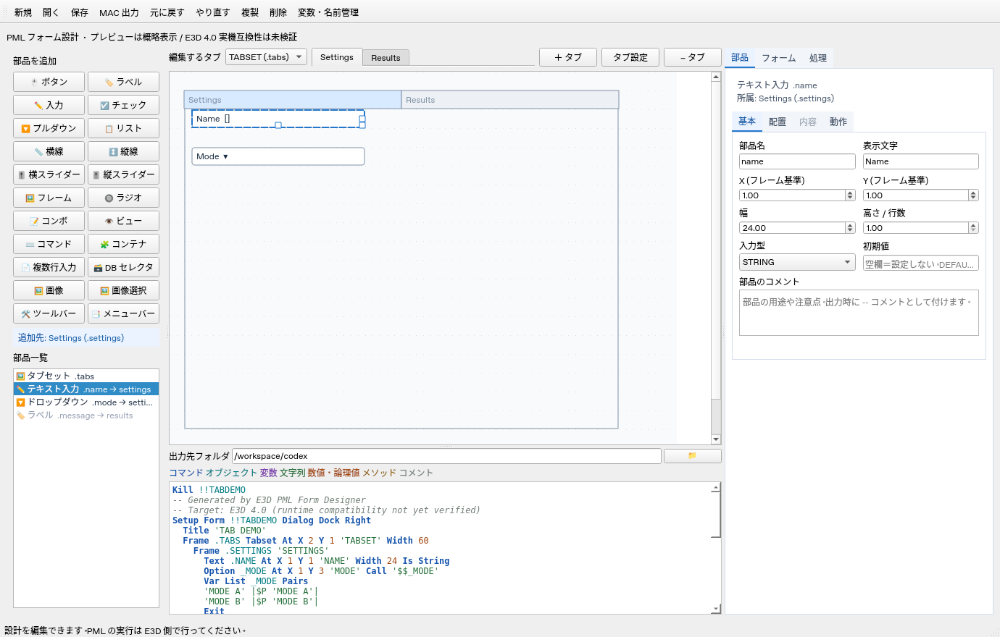

## フレーム内の判定と座標

ABSOLUTE配置の部品をドラッグして放すと、部品全体が収まる表示中の通常FRAMEを親にします。入れ子の場合は最も深いFRAMEを優先し、同じ深さでは面積の小さいFRAMEを優先します。部品の中心だけが枠内でも、端がはみ出す場合はそのFRAMEに入りません。枠外へ出すと、他のFRAMEに収まらなければフォーム直下へ戻します。自己・子孫への移動や、非表示タブへの移動は行いません。

フレーム内のX・Yは、そのフレームの左上を原点にします。親が変わったときは画面上の位置を保って換算します。例えばFRAMEの左上が `(10, 3)`、部品の画面上の位置が `(12, 5)` なら、保存・PML出力する座標は `(2, 2)` です。右のX・Y欄にも「フレーム基準」「フォーム基準」を表示します。親をまたいだ移動では以前の兄弟への配置・幅参照を外し、解決済みのサイズを保持します。Undoで親・座標・参照をまとめて戻せます。

ドラッグで移動するのは押した部品1個です。FRAMEを動かした場合は、その子部品もFRAMEに追従します。AUTOやRELATIVEなど明示した参照配置の追従は維持します。フォーム・FRAMEへの新規追加時は、既存部品と重ならない空き位置を選びます。FRAME内では見出しの下（Y=1以降）に配置します。空きがない場合は追加せず、サイズ変更や追加先の切り替えを案内します。拒否時にはUndo／Redo履歴も維持します。

ラジオボタンはFRAME内のグループとして出力します。追加先がない場合はグループ用FRAMEも同時に作成し、1回のUndoで戻せます。フォーム内にグループの空きがない場合は追加せず案内します。通常FRAME間の移動は可能ですが、FRAME外へのドロップは拒否して元へ戻します。

## タブと入れ子の FRAME

「フレーム」ボタンの矢印から「タブ」を選ぶと、TABSETと2つのタブをまとめて作成できます。 TABSETを選択して通常の「フレーム」を追加すると、現在のタブページ内に配置します。新しいタブページは「＋ タブ」で追加します。ツリーでTABSETに部品をドロップした場合も、現在のタブページ内へ移動します。1回のUndoで戻せます。FRAME を追加して「FRAME 形式」を TABSET に変更する方法も使えます。プレビュー上部の「＋ タブ」でタブを追加し、表示されたタブ見出しをクリックして編集対象を切り替えます。複数のTABSETがある場合は、その左の選択欄で切り替えます。タブ用のFRAMEを手で重ねる必要はありません。

選択中のタブには、そのタブの部品だけを表示します。タブを選んだ状態で部品を追加すると、そのタブ内に配置します。キャンバスのタブ見出しのダブルクリックで、そのタブの表示名を変更できます。「タブ設定」でタブの表示名とオブジェクト名を編集でき、名前変更は子部品やコード参照にも反映します。上部の「編集するタブ」欄の見出しをドラッグするとタブを並べ替え、キャンバス内の見出しをドラッグするとTABSET全体を移動します。「− タブ」で削除でき、部品を含むタブの削除には確認を表示します。変更はUndo / Redoで戻せます。

タブ情報はTABSET自身の `tabs` に保存し、タブ用FRAMEはツリーにTABSETの子フォルダとして表示します。タブの配置領域はTABSETの位置・サイズを引き継ぎ、TABSETをリサイズすると全タブへ反映します。従来のタブページに設定していた独自の座標・サイズは配置領域に使用しません。PML出力時にはE3Dの構文に合わせてタブごとのFRAMEを生成します。設計JSONはバージョン2で保存し、従来のバージョン1（TABSET直下のFRAMEが別部品として保存されたもの）も読み込めます。読み込んだ旧タブは次回保存時にTABSET内の情報へまとめます。親を複製・削除するとタブ内の部品も含めて処理します。

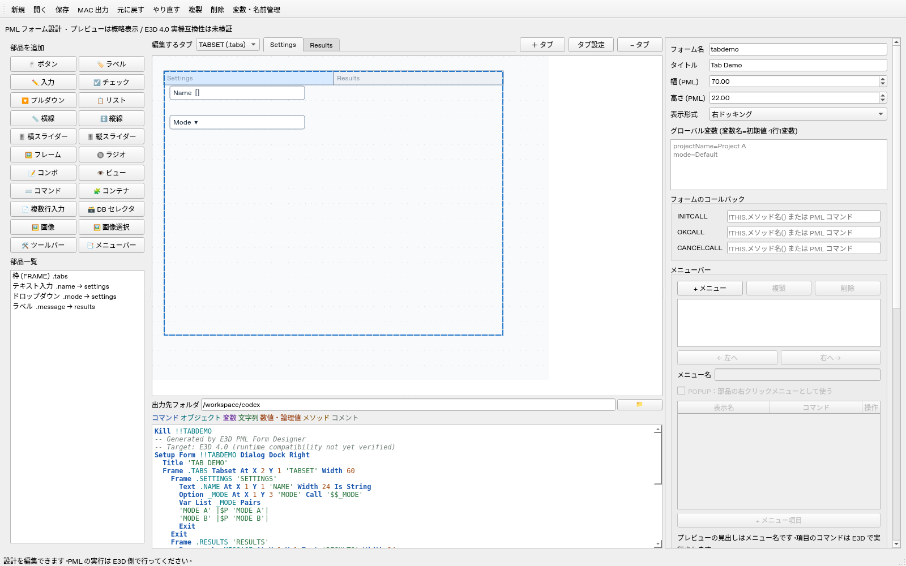

座標指定時の通常 FRAME の出力はユーザー指定の `FRAME .name '表示名'` で、キャンバスの座標・幅・高さは出力しません。このため実際の位置・寸法は E3D の自動レイアウトに依存し、プレビューと一致するとは限りません。

## メニューバー

キャンバス上部の「📑 メニューバー」を押すと、別ウィンドウでメニューを編集できます。初回は空の場合のみ最初のメニューを作り、再度開いても自動追加しません。「+ メニュー」を押し、「タイトル表示名」に見出しを設定します。オブジェクト名は自動設定され、必要に応じて変更できます。「+ メニュー項目」で項目の表示名とコマンドを追加します。各行の「操作」から上へ・下へ・複製・削除を選べます。メニュー全体も「複製」「削除」で編集し、「← 左へ」「右へ →」で表示順を変更できます。複製したメニューには重複しない名前を付けます。保存・読み込みと Undo / Redo に対応し、編集窓内のCtrl+Sでも設計JSONを保存できます。名前は部品名と重複させません。

ユーザー提供の構文で、フォーム定義内に以下を出力します。

```pml
bar
  add 'ツール' .tools
menu .tools
  add '初期化' '!this.DEFAULT()'
  add '実行' '$p |Run|'
exit
```

BARのADDはタイトルとMENUのオブジェクトを関連付け、MENUのADDは各項目とコマンドを設定します。プレビューの見出しもタイトル表示名を使います。「BAR」の登録チェックを外すと、MENUの定義を保持したままメニューバーへの登録を外します。POPUPはBARへ登録しません。既存JSONでタイトル未指定の場合はオブジェクト名を既定値とします。MAC取り込みではBARのタイトル・参照先・表示順を復元し、旧版のBARがないMENUは名前をタイトルとして登録して通知します。コマンドはプレビューでは実行しません。E3D実機での表示・動作は未検証です。サンプルは `examples/menus.json` / `examples/menus.mac` です。

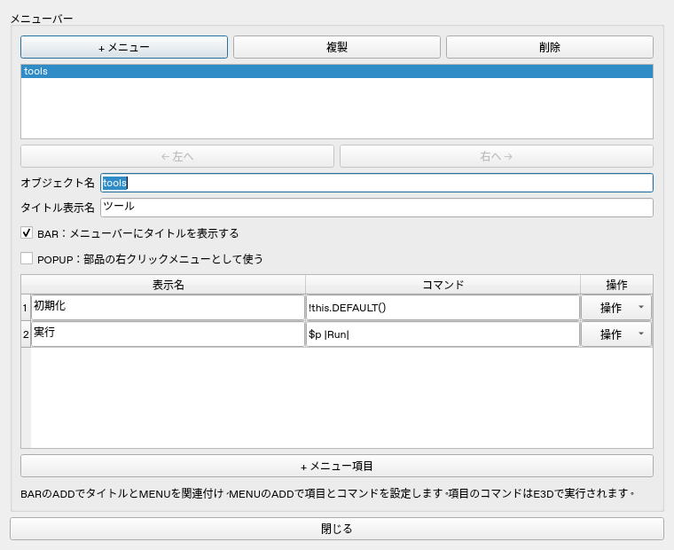

## 生成する構文

ユーザー提供の構文を反映しています。冒頭は変数定義とKillの間、KillとSetup Formの間に空行を入れます。KillとSetup Formの間に生成コメントは出力しません。変数がない場合はKillから始めます。フォーム定義前のユーザー処理・コメントは保持します。

```pml
VAR !!equipmentValue 'P-101'

kill !!equipmenttool

setup form !!equipmenttool DIALOG DOCK RIGHT
  title 'Equipment Tool'
  FRAME .tabs TABSET AT X 2 Y 1 'TABSET' WIDTH 50
    FRAME .page1 'Settings'
      TEXT .equipmentName AT X 1 Y 1 'Name' WIDTH 20 IS STRING
      PARAGRAPH .message AT X 1 Y 3 TEXT 'Message' WIDTH 20
      TOGGLE .enabled AT X 1 Y 5 'Enabled' CALL '!this.onToggle()'
      BUTTON .run AT X 1 Y 7 BACKGROUND 5 'Run' CALL '!this.onRun()' WIDTH 12
      LINE .separator AT X 1 Y 9 '' HORIZ WIDTH 20 HEIGHT 1
      OPTION _mode AT X 1 Y 11 'Mode' CALL '$$_mode'
        VAR LIST _mode PAIRS
        'Mode A' 'COMMAND A'
        'Mode B' 'COMMAND B'
      EXIT
    EXIT
  EXIT
exit
```

BACKGROUND は PARAGRAPH / BUTTON / LIST に対応します。LIST では `list .name BACKGROUND 5 AT X 2 Y 3` のように AT より前に出力します。空欄なら省略します。PARAGRAPH は省略時に背景色になります。色番号は非負整数として出力し、色の対応や有効範囲は E3D で確認してください。プレビューでは BG 番号を表示します。

LINE は HORIZ / VERT を選択できます。表示文字は空文字に固定します。TEXT は STRING / REAL に対応し、幅をWIDTHへ出力します。通常TOGGLE／文字OPTIONの幅、BUTTONの高さ、通常FRAMEの寸法など、指定構文に含まれない寸法はプレビュー用です。通常TOGGLE／文字OPTIONの幅欄は「幅（プレビューのみ）」と表示し、幅ハンドルの説明にもE3Dへの反映がないことを示します。LIST はユーザー指定の順序で `list .name AT X 値 Y 値 '表示名' SINGLE WIDTH 値 HEIGHT 値` と出力し、コンストラクタ内の `.dtext` を使用します。相対配置でも AT は表示名の前です。AUTO では AT を省略します。

OPTION は `_` 付きの名前を出力します。名前入力に `_` を付けても重複付与しません。選択肢のコマンドを空欄にすると空文字を出力します。コマンドの妥当性は E3D 側で確認してください。

PAIRS型OPTIONは、OPTION〜EXITの内部（VAR LISTと選択肢）を1段下げて出力します。MACの読み込みではインデントを親子関係の根拠にせず、FRAMEと対応するEXITで所属を判断します。VAR LIST・MENU・VIEWの内部のEXITは、それぞれのブロックだけを閉じます。

## DEFAULT と表示後プログラム

「DEFAULT メソッドの処理」欄には外枠なしで、例えば次を入力します。

```pml
!!equipmenttool.equipmentName.VAL = !!equipmentValue
```

生成結果は次のようになります。

```pml
DEFINE METHOD .DEFAULT()
!!equipmenttool.equipmentName.VAL = !!equipmentValue
ENDMETHOD
```

新規設計ではフォーム定義の `exit` の後、すべての `DEFINE METHOD` より前に `SHOW !!equipmenttool` を出力します。「表示後のプログラム」は SHOW の直後、メソッド定義より前に追加します。SHOW は常にメソッド定義より前に出力します。初期値がある場合は DEFAULT の先頭へ設定コードを生成し、コンストラクタの最後で `!this.DEFAULT()` を呼び出します。手入力の DEFAULT 処理は自動設定の後に出力するため、同じ値を指定した場合は手入力が優先されます。旧サンプルの表示後プログラムにある明示的な DEFAULT 呼び出しは残るため、必要に応じて削除してください。

## 検証と制約

```powershell
.\.venv\Scripts\python.exe -m unittest discover -s tests -v
```

ヘッドレス Linux は `QT_QPA_PLATFORM=offscreen` を指定します。GUI 起動、マウス移動、プロパティ編集、親子構造、ページ切替、履歴、保存・読込、PML 生成、文字コードエラーによる上書き防止を検証します。E3D ランタイムの検証ではありません。

プレビューの横幅・行高さは概略値で、フォント・DPI・tagwidth による描画までは再現しません。フォームサイズは 1〜300、部品は500個までです。表示文字列の `$` 展開は拒否し、CALL / PAIRS コマンド内では許可します。処理コードや表示後プログラムはそのまま出力し、PML 構文チェック・実行は行いません。安全な引用符を選べない文字列は出力を拒否します。

RGROUP、外部グリッドの詳細設定、E3D との直接連携は未実装です。既存MACの取り込みは下記の範囲で対応しています。RTOGGLE と CONTAINER の定義・設定には対応しています。第三者ソースの転載は行っていません。調査元と互換性の注意点は [docs/research.md](docs/research.md) を参照してください。

## 既存MACから編集環境を復元

「ファイル → MACを読み込む…」または「開く」で .mac を選びます。SJIS（CP932）、UTF-8、BOM付きUTF-16を自動判別します。1ファイルに1つの SETUP FORM があるフォームが対象です。処理だけのマクロ、式で計算する座標、未対応の部品宣言はエラーとして表示します。取り込み失敗時は現在の設計・履歴を保持します。MACを実行して復元する機能ではありません。

BAR付きのメニューバーも読み込めます。フォームの最後のEXITが省略されている場合は、SHOW !!対象フォームを宣言の終端として扱い、取り込み結果で補完を知らせます。SHOWまでに閉じられていないFRAMEも親子関係を保って補完します。再出力では必要なEXITを記載し、SHOWはメソッド定義より前に置きます。SHOWに付いたコメント、表示後のコード、メソッド本文は保持します。

表示前の処理があるMACや条件付きのSHOWは、SHOWを含む表示プログラム全体を元の順序で保持します。SHOW → HIDE → SHOWのような後続の表示命令も残します。SHOWのない元MACにはSHOWを追加しません。保持した処理は「処理」の表示プログラム欄、または「取り込みコード」の「表示プログラム」で編集できます。通常の新規設計は従来どおりSHOWを自動生成します。フォーム末尾のEXITにまたがるコメントも、完全なコメントとして残します。

対応する宣言から、部品、フレームの親子関係、TABSETのページ、メニュー、座標・相対配置、LISTの見出し・行列、DTEXT／RTEXT、初期値、コールバックを復元します。フォーム名は `!!Demo` に限定せず、`!Demo`、`.Demo`、`_Demo`、`!!_Demo`、`Demo`などを読み込みます。先頭の`!`・`.`の組み合わせと名前の先頭の`_`を保持し、Kill・Setup Form・Showにも同じ表記を出力します。ツリー・フォーム設定・名前管理にもその表記を表示します。`VAR !名前 '文字列'`はローカル変数欄へ復元し、文字列以外の初期化は元コードとして保持します。本エディタの外部マクロ呼び出しの形式も取り込みます。通常の .名前 型OPTIONはWIDTHとCALLを保持し、従来の _名前／PAIRS型と区別します。ユーザーの名前・文字列・処理本文の大文字小文字を保持します。MACに記録されていないフレーム寸法などは推定し、取り込み結果で知らせます。元の画面のフォント・DPIや編集用の部品順は復元できません。

宣言の区切りに連続した空白やタブがあっても読み込みます。引用符の内部の空白・タブは詰めません。`'文字列'` と `|文字列|` は同じ文字列として扱い、一方の記号を文字列へ含める場合はもう一方を区切りに使えます。文字列内のEXIT・コメント風の記号・カンマなどは、宣言の終了やコメントとして解釈しません。引数なし定義の `(   )` にも対応し、紐付けた引数なしCALLの文字列内の空白も保存・再出力・コピーで保持します。メソッド名を変更した場合は現在の呼び出し先へ追従します。表示文字列の`$`展開、改行・NUL、閉じていない引用符などの既存制限は残ります。CALL・PAIRSのコマンドと画像パスには`$`を使用できます。

単純な初期化は部品の編集項目へ変換します。複雑なコンストラクタはDEFAULTとともに元コードとして保持し、初期化コードの自動生成を抑えます。この場合、選択肢などの初期化は「編集 → 取り込みコードを編集…」で編集してください。同画面では、フォーム定義前の処理、コンストラクタ、DEFAULT、その他のメソッドも編集できます。本文が空・空白だけ・コメントだけのメソッドは、コンストラクタ・取り込んだDEFAULT・補助メソッドを含めてMACへ出力しません。既知の空メソッドへの単独の引数なし呼び出しと、自動コールバックも省略します。初期値や選択肢・表の設定処理があるメソッドは出力します。編集用JSONには元の本文を保持します。式の一部や引数付きの手入力呼び出しは自動削除しないため、その参照は必要に応じて編集してください。元コード優先の場合は、DEFAULTの自動呼び出し設定を無効表示にします。追加メソッドの引数・戻り値・本文を保持し、呼び出し先を先に定義します。コードの意図を解析する完全な逆コンパイラではありません。 DEFAULTが選択肢設定より前にある場合や複数回呼び出される場合、複数のメソッドが同じ表を初期化する場合は、元コードで呼び出し順を保持します。後続処理で使うローカル配列もコードとして残します。PAIRS型OPTIONを参照する相対配置・幅参照には実際の部品名を使います。

旧版で取り込んだ時点で省略された処理や変更された実行順は、JSONだけから復元できません。該当する場合は元MACから再読み込みしてください。

DEFAULTは、代入の対象・順番を維持できる場合だけ初期値欄へ変換します。その他は元コードのみを出力し、元MACにないスライダーや複数行テキストの初期化を追加しません。スライダーの宣言時のVALとDEFAULT内の値は別々に保持します。元コードを保持している間は初期値欄を無効にし、「取り込みコード」のDEFAULT欄で編集します。同画面のDEFAULT生成形式を変更すると、部品の初期値からの生成へ切り替えられます。元の代入が残っている場合は、必要に応じて同画面で整理してください。

同じメソッド名を複数部品で使用する場合、処理本文の編集は全使用部品へ反映します。既存のメソッド名へ変更すると、そのメソッドの本文を使用します。DEFAULTをコールバックに指定した場合の本文も、フォームのDEFAULT欄と同じ処理です。Undo／Redoでは関連する変更をまとめて戻します。

取り込み後は未保存の設計になります。「保存」で元MACと同じフォルダの .json を初期候補として提示します。元MACは読み込み・JSON保存で上書きしません。変更をE3Dへ渡すときは「MAC 出力」を使います。相対画像パスは、保存先JSONのフォルダ、取り込み元MACのフォルダ、アプリのフォルダの順に探します。取り込み元のパスは設計JSONと作業復元に保存します。E3D 4.0での取り込み後の実行は実機で確認してください。

### MACの部分取り込み

通常の取り込みが未対応の宣言で止まる場合は「ファイル → MACを部分的に読み込む…」を使います。読めない宣言や不正な部品指定を省略し、読める部品・メニュー・初期値・メソッドを復元します。未対応のFRAMEは子部品を含むブロックごと省略し、復元できなかった部品を相対配置の参照先にしている部品も省略します。EXITのないMENUなどは次の部品宣言を境に復帰できる場合があります。未知のブロックの省略範囲は、その付近の本文とEXITから推定します。別の未知オブジェクトやTITLE・BARなどのフォーム指定を境に判定し、省略範囲と前後のFRAMEへの所属・配置を確認してください。フォーム終了後に部品宣言やBARが残る場合は、実行プログラムへ移さず部分取り込みを中止します。

省略した行番号と理由、元MAC全文を設計JSONと作業復元に保持します。画面下部の「部分取り込み」から「取り込みコード」を開き、「省略理由」「元MAC（参照用）」で確認できます。元MACは参照用で、MAC出力にはそのまま追加しません。未復元の部品を参照する処理や動的な呼び出しは手動で確認してください。

部分取り込みも完全な逆コンパイラではありません。SETUP FORM・フォーム名・フォーム境界が不明な場合、残った設計の検証に失敗した場合、100件を超える省略が必要な場合は中止し、現在の設計を保持します。4MB・500部品の制限は通常の取り込みと共通です。通常の「MACを読み込む」は従来どおり未対応の宣言をエラーとして扱います。

### 補助メソッドの共通管理

「編集 → 補助メソッド管理…」で、部品との紐付けを判定できないメソッドや独立した補助メソッドを一覧から選び、名前・引数／戻り値・本文を編集できます。追加・削除にも対応します。初期値と各部品のコマンド、部品に紐付いた処理は従来の部品・処理欄で編集します。自動生成する表の設定やDEFAULTもこの一覧へ移しません。

コード内の呼び出しの参照候補を表示し、リネーム時には既知の参照を更新します。呼び出しが残るメソッドの削除は拒否します。コメントと通常の文字列の値はリネームで変更しません。CALLBACK・INITCALLなど、フォーム／部品のコールバック代入にある呼び出しは更新します。変数へ文字列として組み立てたコマンドや外部からの参照は判定できないため、手動で確認してください。参照表示が空でも未使用と断定しません。OKでまとめて適用し、Undo／Redoで戻せます。キャンセルは設計を変更しません。

## 監査後の修正

- 文字列の編集を入力時に反映し、フォーカスを移さず Ctrl+S しても最新の値を保存します。
- OPTION / LIST の改行とカーソル位置を保持します。選択肢より多い OPTION コマンドを入力しても削除せず、行数を揃えるまで出力エラーとして表示します。
- 設計ファイルのフィールド型を検証し、不正な処理コード・選択肢などを読込時に拒否します。
- 終了後の Scene 参照や遅延更新を抑止します。

追加調査: [PML の具体例・公開コードとの照合](docs/pml-examples-research.md)。ライフサイクル、イベント、OPTION、TABSET、型、ロード方式を整理しています。

### 相対配置・自動配置

右の「配置方式」で `ABSOLUTE`（座標）、`RELATIVE`（部品参照）、`AUTO`（直前の部品から自動配置）を選びます。

- `RELATIVE`: X/Y の参照部品と端（XMIN/XMAX、YMIN/YMAX）、オフセットを指定します。X の基準を RIGHT にすると自身の幅を引き、右端を合わせます。出力例: `AT XMAX.base-SIZE YMAX.base+0.5`。
- `AUTO`: PATH の DOWN/UP/LEFT/RIGHT、HALIGN の LEFT/CENTRE/RIGHT、VALIGN の TOP/CENTRE/BOTTOM、HDIST/VDIST の間隔を出力します。基準部品は部品一覧の同じ親に属する直前の部品です。
- 幅参照: `WIDTH.base` で参照先に幅を合わせます。TOGGLE / OPTION は未対応です。

参照方式ではドラッグと直接座標編集を無効にし、参照先の位置・幅を変えるとプレビューを追従させます。参照先の名前変更とコンテナ複製では参照名も更新します。参照先削除、別の親への参照、自身・循環参照は出力を止めます。参照先を先に出力しますが、この並べ替えで AUTO の基準が直前でなくなる場合はエラーにします。

相対配置の保存例は `examples/relative.json` / `examples/relative.mac` です。プレビューの寸法は概算で、通常 FRAME の自動寸法や E3D の文字幅によって実際の配置は変わります。出力構文は公開資料を参考にしていますが E3D 4.0 実機では未検証です。

## 追加ガジェット

### 画像・複数行入力・DB 選択・ツールバー

`examples/extra-features.json` は画像表示、画像 OPTION、TEXTPANE、SELECTOR、ポップアップメニュー、OK / CANCEL ボタンのサンプルです。サンプル画像も `examples/assets/` に同梱しています。

| 追加機能 | 操作と出力 |
| --- | --- |
| 画像 PARAGRAPH | 「🖼️ 画像」で追加。「画像ファイルを選択」またはパス入力で設定。`PIXMAP '画像パス' WIDTH … HEIGHT …` を宣言行に出力 |
| 画像 BUTTON / TOGGLE | 部品の「文字 / 画像」を `PIXMAP` に変更し、画像を指定。単一画像の `.AddPixmap()` を出力 |
| 画像 OPTION | 「🖼️ 画像選択」で追加。「画像ファイルを追加」は複数選択可能。画像パスを1行1件、RTEXT 実値を同じ行順で入力。`.名前` で宣言し、画像配列を `.DTEXT`、実値配列を `.RTEXT` に設定 |
| TEXTPANE | 「📄 複数行入力」で追加。初期内容を行ごとの配列として `.VAL` に設定。「FIXCHARS」で等幅フォントを選択 |
| DATABASE SELECTOR | 「🗃️ DB セレクタ」で追加。`DATABASE OWNERS / MEMBERS / AUTO` と `SINGLE / MULTIPLE` を設定 |
| TOOLBAR | 「表示形式」を `MAIN フォーム` に変更し、「🛠️ ツールバー」で追加。FRAME TOOLBAR 内に対応部品を配置 |

画像パスは `\\SERVER\Images$\sample.png` のようなサーバー共有パスの `$` を保持して出力します。画像の保存・再読み込みと画像選択の配列でも同じ扱いです。改行・NULや、引用符を安全に選べないパスは「画像パス」のエラーとして表示します。サーバー画像のプレビューには、アプリを実行するPCから共有ファイルへアクセスできる必要があります。

文字 OPTION の従来の `OPTION _名前` / `VAR LIST ... PAIRS` は維持しています。画像 OPTION はコマンドの PAIRS と異なる方式です。文字と画像を切り替えると、既知のコード表記の `!THIS._名前` / `!THIS.名前` と `!!フォーム.名前` の参照も更新します。PIXMAP から TEXT に戻すと画像用 RTEXT とメソッド名を解除します。Undo で戻せます。文字 OPTION と画像 OPTION の名前表記の違いは名前管理にも反映しています。

画像は元ファイルのピクセル寸法で表示し、画像 OPTION は先頭の画像を拡大縮小せずに表示します。ファイルを読めない場合はパスの説明を表示します。画像は設計 JSON に埋め込まず、PML へパスをそのまま出力します。E3D から読み込めるパスに変更し、画像ファイルも配置してください。

PIXMAP の「幅 (px)」「高さ (px)」は元画像から自動取得し、読み取り専用にします。画像部品にはサイズ変更ハンドルを表示せず、幅参照も使用しません。画像を変更すれば元寸法を取り直します。画像 OPTION は選択肢の最大幅・最大高さを使用します。一部の画像が読めない間は保存済み寸法を縮めず、読めた画像が大きい場合には広げます。すべての画像が読めるようになった場合や、読めない項目を削除した場合には、残った元画像の最大寸法へ更新します。既存JSONを開いたときにも元寸法を取り込み、変わった場合は未保存状態になります。座標はフォーム単位で、範囲チェックにはピクセル寸法を換算して使用します。元画像が親の領域より大きい場合は、フォーム／フレームを広げるか元画像ファイルを小さくしてください。

TEXT・文字PARAGRAPH・チェック（TOGGLE）・プルダウン（OPTION）・コンボ（COMBO／COMBOBOX）は高さを1行に固定します。高さ欄は読み取り専用で、縦と右下のサイズ変更ハンドルは表示しません。COMBOのSCROLLはプルダウンを開いたときの表示量で、閉じた部品の高さには影響しません。PIXMAPを使うチェック・画像OPTIONは元画像の寸法に固定します。複数行入力は TEXTPANE を使用してください。

線とスライダーは太さを固定します。横線の高さ／縦線の幅は1.0、横スライダーの高さは1.0、縦スライダーの幅は3.0です。横向きはWIDTH、縦向きはHEIGHTで長さを変更します。右パネルまたはミニ編集で向きを変えると幅・高さを入れ替え、新しい向きの太さを固定値に戻します。たとえば横線の幅14.25は、縦にすると高さ14.25・幅1.0になります。幅参照で長さを指定していた場合は実際の長さを取り込み、参照を解除します。Undoで向き・寸法・参照をまとめて戻せます。

メソッドは既知の `!this.メソッド(...)` / `!!フォーム名.メソッド(...)` の呼び出し先を先に定義します。DEFAULTとリスト初期化メソッドは、それらを呼ぶコンストラクタより先に記載します。定義順を変えても初期化の実行順は保持し、選択肢・表データを設定した後でDEFAULTを呼びます。呼び出しの解析では引用文字列、`--`／`$*`の行コメント、`$(`〜`$)`のブロックコメントを除外します。コメントだけの本文は空の処理として省略します。ユーザーの本文・名前・大文字小文字は変更しません。循環した呼び出しで定義順を決められない場合は、循環するメソッド名を表示してMAC出力を止めます。設計JSONは保存できます。

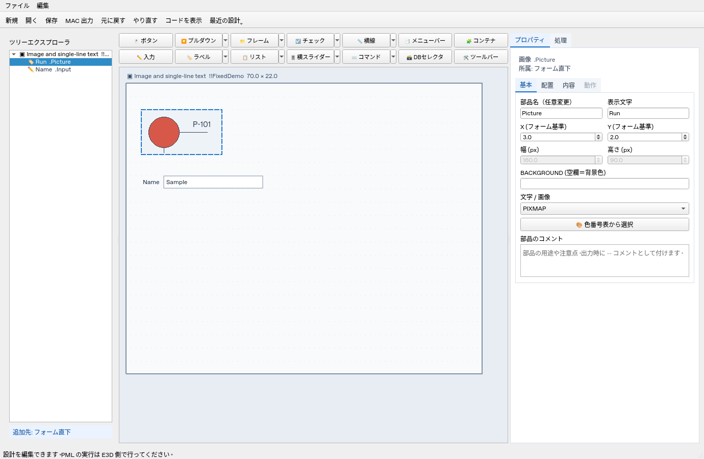

画像 PARAGRAPH は宣言時に画像パスを指定し、後続の AddPixmap は出力しません。画像未指定なら空の文字PARAGRAPHとして出力し、空のPIXMAPファイルを探さないようにします。起動時だけ「f&m: PIXMAP file not found」が出る症状への修正ですが、警告が解消するかはE3D実機での確認が必要です。BUTTON／TOGGLEは参考資料に合わせてコンストラクタのAddPixmapを使用します。E3D のフォント・DPI による座標の違い、画像の選択動作と DB の内容も実機で確認してください。

TOOLBAR の保存例は `examples/toolbar.json` / `examples/toolbar.mac` です。ボタン・チェック・OPTION・TEXT・COMBO・SLIDER に対応し、部品一覧の順に横並びになります。TOOLBAR 内の AT 座標は出力せず、座標ドラッグ・相対配置・AUTO・幅参照は使用しません。ツールバーの位置・寸法はプレビュー用です。MAIN は E3D アプリケーションのメインフォーム向けで、既存アプリへの登録や `!!appTbarCntrl` の設定は用途に合わせて追加してください。新規設計は MAIN を含め SHOW を常に出力します。取り込んだMACの表示プログラムは元の順序を保持します。既存JSONの `show_form` は互換性のため読み込みますが、出力の抑制には使いません。

### フォームのコールバックとポップアップ

「フォームのコールバック」で `INITCALL`、`OKCALL`、`CANCELCALL` に実行する PML コマンドまたはメソッド呼び出しを指定します。コンストラクタの `!THIS.INITCALL = ...` などとして出力します。メソッドの定義は自動生成しないため、呼び出すメソッドは部品の処理コードや任意の PML プログラムに用意してください。INITCALL は表示時、OKCALL は OK / APPLY、CANCELCALL は CANCEL / 閉じる際の処理です。AUTOCALL は構文・動作を今回の参照資料で確認できず、設定には含めていません。

BUTTON の「ボタン属性」で `NORMAL / OK / APPLY / CANCEL / RESET / HELP` を選択できます。OK / CANCEL / HELP に切り替えると部品自身の CALL とメソッド名を解除します。OK / CANCEL の処理はフォーム側に指定してください。HELP は E3D のヘルプ動作です。変更は Undo で戻せます。

メニュー編集で「POPUP」をチェックし、対象部品の「ポップアップメニュー」で選びます。VIEW、ALPHA、LIST、BUTTON、TOGGLE、TEXT、COMBO、SLIDER に設定でき、`.SetPopup(!THIS.メニュー名)` を出力します。プレビューでは対象部品を右クリックすると項目を表示し、選択時にコマンドをステータスバーへ表示します。E3D コマンドは実行しません。メニュー名変更時に割り当てを更新し、メニュー削除またはPOPUPの解除時は割り当てを解除します。名前管理の参照一覧にも表示します。

これらは公開資料に基づく実装で、E3D 4.0 実機では未検証です。調査根拠は [追加機能の調査記録](docs/pml-examples-research.md#画像と追加機能の実装) を参照してください。

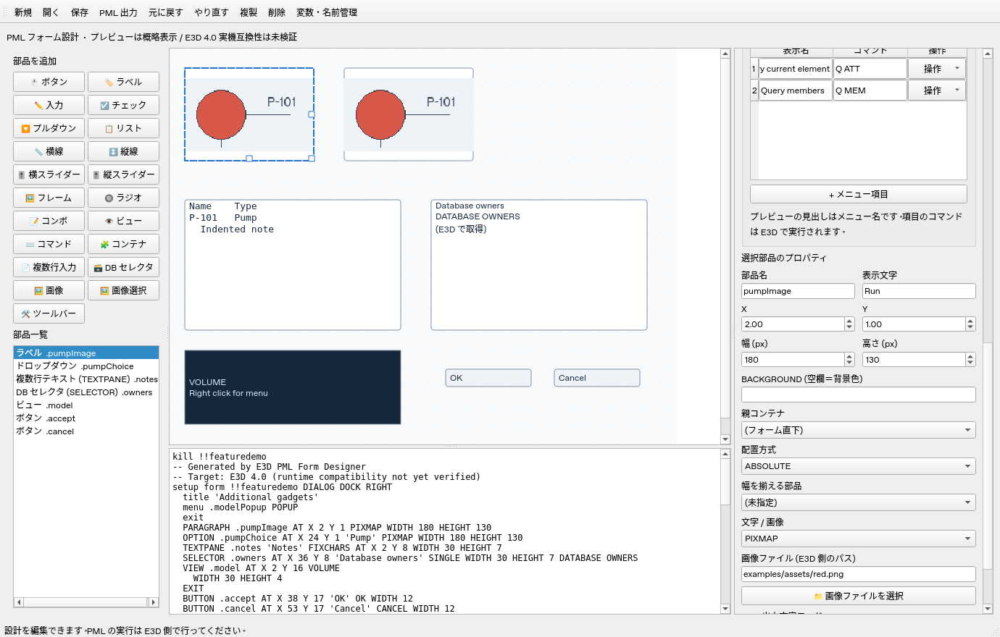

`examples/gadgets.json` を開くと、追加部品をまとめて確認できます。PML のサンプルは `examples/gadgets.mac` です。右側には部品に関係するプロパティを表示します。

| 部品 | 設定・出力 |
| --- | --- |
| SLIDER | HORIZONTAL / VERTICAL、最小値・最大値・STEP・VAL。イベントメソッドは `(!gad is GADGET, !event is STRING)` を持つ open callback です。DEFAULT や通常部品と同じメソッド名は使えません。 |
| RTOGGLE | OFF / ON の実値を指定します。追加先がない場合はグループ用FRAMEも作成します。同じ FRAME 内をラジオグループとして出力し、選択状態は FRAME 側で管理します。 |
| LIST | SINGLE / MULTIPLE の選択方式、単列の表示名 `.dtext`・実値 `.rtext`、複数列の SetHeadings / SetRows。 |
| COMBO | 編集可能な選択欄として定義します。公開例に合わせ、定義キーワードを COMBO / COMBOBOX から選べます。表示名と実値に対応します。 |
| VIEW | ALPHA / AREA / PLOT / VOLUME、幅・高さ、任意の ASPECT、内部の追加 PML。追加 PML には VIEW の外枠や EXIT を書きません。 |
| コマンド欄 | VIEW ALPHA として出力し、CHANNEL REQUESTS / COMMANDS を指定できます。 |
| CONTAINER | PMLNETCONTROL を出力します。アセンブリ・名前空間・型をすべて指定すると import、using namespace、保持用 member、生成と Control.handle 接続を出力します。 |

LIST / COMBO の実値は表示名と同じ行数で入力します。実値を空欄にすると `.rtext` を省略します。OPTION の実行コマンドとは別の設定で、実値をコマンドとして実行する処理は生成しません。

CONTAINER のアセンブリ・名前空間・型をすべて空欄にした場合は、Control 接続を DEFAULT などに記述してください。入力値に応じた外部 DLL は E3D 側で準備する必要があります。保持用メンバー名は `部品名Control` です。イベント購読や終了処理は用途に応じて記述してください。

キャンバスではスライダーの初期位置や部品の形を概略表示します。E3D のモデル描画、コマンド実行、外部 DLL の読み込みはプレビューでは実行しません。VIEW VOLUME のモデル表示には drawlist の作成・接続なども必要です。SLIDER の表示文字は出力されず、RTOGGLE / COMBO の高さなどはプレビュー用です。追加ガジェットの構文・イベントは E3D 4.0 実機での確認が必要です。構文の出典は [調査資料](docs/pml-examples-research.md) を参照してください。

## LIST の複数列

LIST を選び、「LIST 表示方式」を `TABLE` にすると表入力欄を表示します。先頭行に見出し、その下に各行のデータを入力します。「+ 列」「+ 行」で増やし、削除する列・行のセルを選んで「列削除」「行削除」で減らします。最後の1列と見出し行は残します。セルを編集中でも保存に反映し、Undo / Redo と複製に対応します。

`SINGLE` / `MULTIPLE` は行の単一選択・複数選択の設定で、列数とは独立です。`SIMPLE` に戻すと単列リストを使い、表データは保持します。TABLE では単列の `.dtext` / `.rtext` を出力せず、見出しと二次元の行配列を使います。

ユーザー提供の例に合わせ、TABLE の定義には `HEIGHT` を出力します。位置の AT は表示名の前、SHOW はすべてのメソッド定義より前です。設定メソッド名は編集可能で、空欄なら `populate_部品名` にします。コンストラクタからこのメソッドを呼びます。

```pml
define method .fillEquipment()
  !HEAD = ARRAY()
  !HEAD[1] = '番号'
  !HEAD[2] = '種類'
  !THIS.equipment.setheadings(!HEAD)
  !ROWS = ARRAY()
  !ROWS[1] = ARRAY()
  !ROWS[1][1] = 'P-101'
  !ROWS[1][2] = 'Pump'
  !ROWS[2] = ARRAY()
  !ROWS[2][1] = 'T-201'
  !ROWS[2][2] = 'Tank'
  !THIS.equipment.setrows(!ROWS)
endmethod
```

`!ROWS[行番号][列番号]` はどちらも1から始まります。SetRows は調査済みの公開資料を参考にしています。E3D 4.0 実機の構文・表示・選択動作は未検証です。サンプルは `examples/multicolumn.json` / `examples/multicolumn.mac` です。

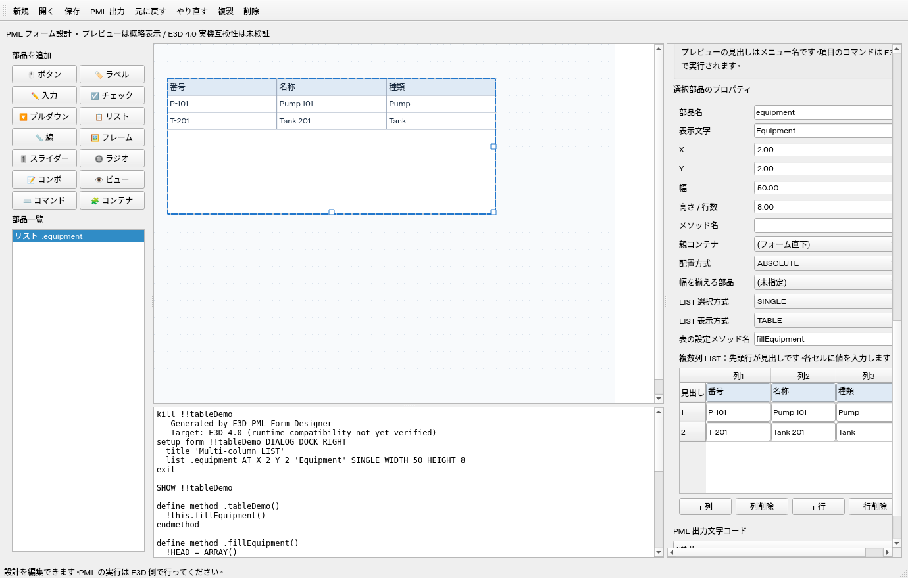

単列 LIST の複数選択も、ユーザー提供の `MULTIPLE WIDTH 値 HEIGHT 値` に対応しています。表示名の配列をコンストラクタ内で作り、`!this.部品名.dtext = !choices` として代入します。`!choices` はローカル変数名で固定キーワードではありません。旧設計ファイルの `MULTI` は読み込み時に `MULTIPLE` へ置き換えます。

VIEW の「ASPECT (VIEW)」欄は空欄で省略、0より大きい有限数で指定します。出力は `WIDTH 30 HEIGHT 8 ASPECT 1.5` のように HEIGHT の直後です。キャンバスの枠サイズは WIDTH / HEIGHT に基づきます。ASPECT の E3D 側での表示への効果は実機で確認してください。

## 変数・オブジェクト名管理

部品プロパティは、部品名と表示文字、X と Y、幅と高さ、最小値と最大値などを2列で表示します。CALL コマンドや処理コード、選択肢、表入力は全幅で表示します。選択した部品や配置方式に応じて項目を切り替え、片方だけ表示する項目は全幅を使います。

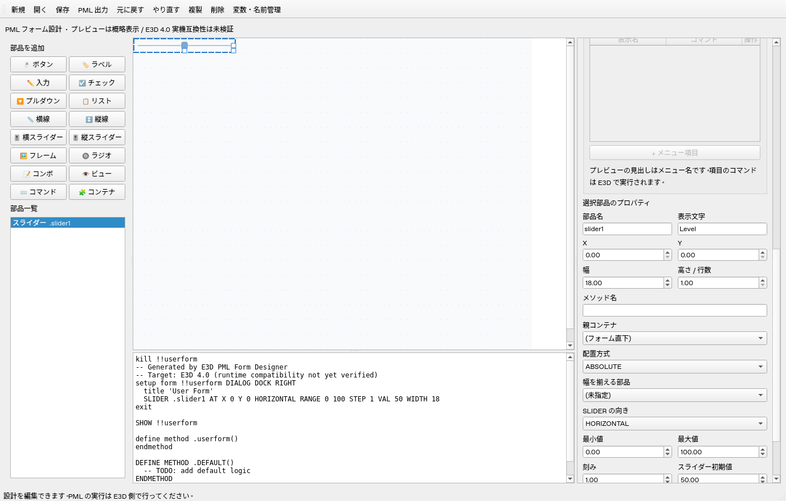

キャンバスまたは部品一覧にフォーカスがあるとき、次のキーで選択部品を編集できます。

- `Delete`: 削除（フレームは子部品も削除）
- `Ctrl+C` / `Ctrl+V`: コピー / 貼り付け（フレームは子部品もコピー）
- `Ctrl+X`: 切り取り
- `Ctrl+Z`: 元に戻す

コピー・複製では部品名とコールバックのメソッド名を重複しない名前に変更します。コピーした部品間の親・配置参照、既知のコード表記の部品参照、表の設定メソッド、CONTAINER の生成メンバーも更新します。共通のコールバックを持つ部品を一緒にコピーした場合は、コピー内でも共通の新しいメソッドを使用します。

コピーした処理が呼び出す取り込み済みの補助メソッドは、その呼び出し先まで一緒にコピーし、名前の衝突を避けて参照を更新します。使用する登録済みグローバル変数も、貼り付け先に同名がない場合は初期値ごと引き継ぎます。同名の変数がある場合は貼り付け先の値を保持します。同じ設計への切り取り復元では、呼び出し先まで一致する既存の補助メソッドを再利用します。コメントや通常の文字列の値を依存関係として扱わず、コピーでもその値を変更しません。フォーム／部品のコールバック代入内の呼び出しは引き継ぎます。文字列として組み立てる動的な呼び出し、外部マクロやコピー範囲外の部品への依存は自動で取り込みません。

位置はコピー元と同じなので、貼り付け直後は重なって表示されます。別の設計に子部品を貼り付け、元の親が存在しない場合は、親の位置を加えたフォーム上の座標を保持します。コピーの AUTO 配置はコピー時の座標に変換します。同じ設計内で切り取りを貼り付け、元の名前が空いている場合は、元の名前・順序を復元して配置参照とAUTOを保持します。切り取り直後に参照先が一時的に不在になる場合は、貼り付けまたはUndoまで出力エラーになります。

別プロジェクトへの貼り付けで配置条件などが成立しない場合は、ステータスバーに理由を表示して変更を取り消します。貼り付け対象はこのエディタでコピーした部品です。文字入力欄では、これらのキーは通常の文字編集に使います。

ツールバーの「変数・名前管理」、または `Ctrl+M` で管理画面を開きます。

- 「グローバル変数」: `VAR !!名前 '初期値'` の変数を追加し、初期値と名前を変更できます。参照箇所を一覧に表示します。使用中の変数は、コードの参照を削除してから削除します。
- 「ローカル変数」: `VAR !名前 '初期値'`の追加・値編集・削除・一括リネームに対応します。参照更新と使用中の削除判定はフォーム定義前・表示プログラムの範囲で行います。メソッド内の引数や同名ローカル変数は別スコープとして保持します。グローバルとローカルで同じ名前を使用できます。`!this`は登録できません。
- 「オブジェクト」: フォーム・部品・メニューの名前、実際のPML名、親、参照箇所を確認し、名前変更できます。OPTION の `_` 付きのPML名も表示します。
- Ctrl / Shift で複数の行を選び、「一括リネーム」で接頭辞・接尾辞・文字列置換・連番を指定できます。「表示行を全選択」は検索で表示されている行だけを選びます。候補の表を直接編集して名前を入れ替えることもできます。重複や不正な名前は反映前に検出し、全件をまとめて更新します。
- 「候補を生成」は連番（有効な場合）→文字列置換（大文字・小文字を区別）→接頭辞・接尾辞の順に処理します。「管理画面へ反映」の後、管理画面の「適用」でプロジェクトに反映します。
- 検索欄で名前・種類・親・参照先を絞り込めます。参照箇所の長い文字列はマウスを重ねて確認できます。

管理画面内で編集し、「適用」でプロジェクトへ反映します。未適用の変更は「閉じる」で破棄します。適用1回をメイン画面のUndoで戻せます。ファイル保存はメイン画面の「保存」で行います。

親、X/Yの相対配置、幅参照は名前変更に合わせて常に更新します。「コード内の参照も更新」が有効なら、DEFAULT、表示後プログラム、部品のCALL・処理コード・VIEWコード、OPTIONコマンド、メニューコマンドにある `!!変数` / 読み込んだ表記のフォーム / `!THIS.部品` / フォーム.部品も更新します。識別子の境界を確認し、`part` の変更で `partMore` は変更しません。CONTAINERの生成メンバー名と複数列LISTの自動メソッド名も追従します。

コード更新はPML全体の構文解析ではなく、既知の参照表記を対象にした置換です。同じ表記がコメントやコールバック文字列にある場合も更新します。文字列を連結して作る名前、別のローカル変数からの参照などは自動更新できません。チェックを外す場合はコード内の参照を手動で修正してください。管理対象の変数は現在グローバルVARです。生成するHEAD・ROWSなどのローカル変数名と、メソッド名・外部DLLの型名はこの一覧では変更しません。

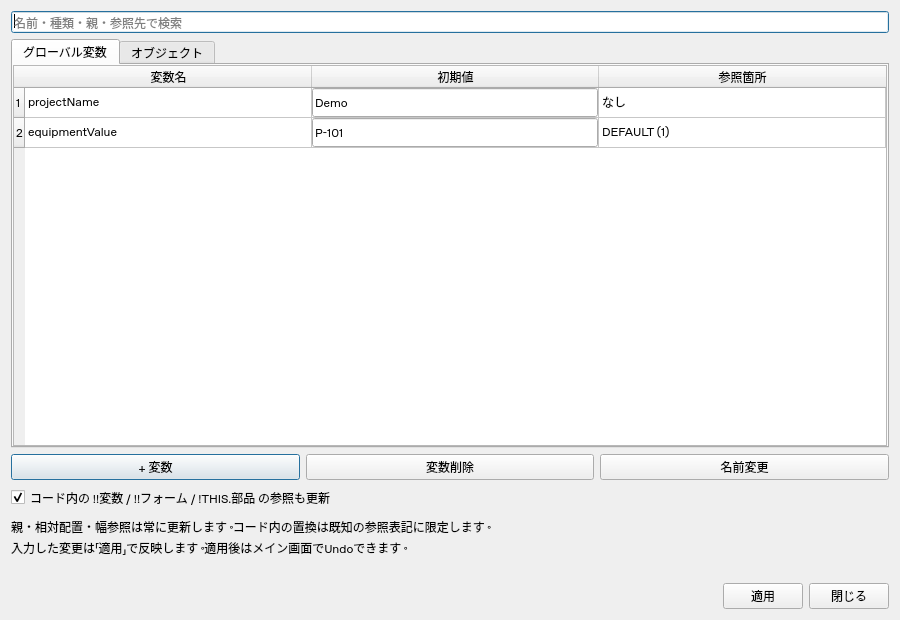

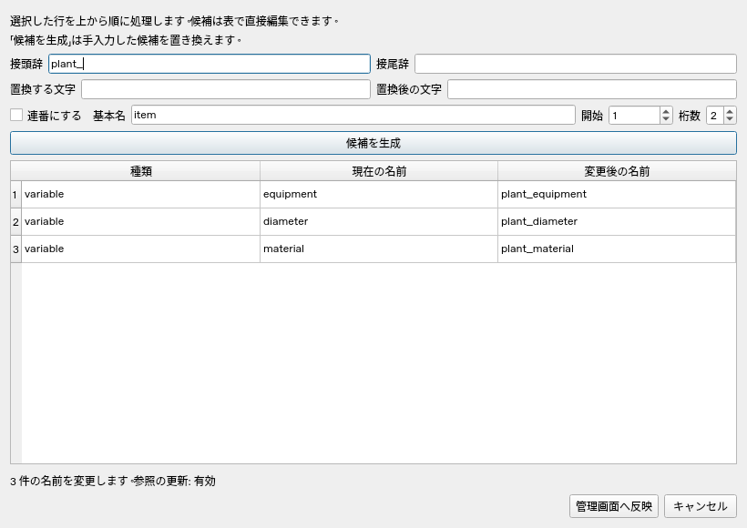

キャンバス上部の「📑 メニューバー」ボタンで別ウィンドウを開き、タイトル表示名・オブジェクト名・項目の表示名・コマンドを編集します。メニューを追加すると、キャンバス上部に枠で囲ったメニューバーのプレビューを表示します。

フォームの「表示形式」で右・左・上・下ドッキングを選べます。それぞれ `DIALOG DOCK RIGHT / LEFT / TOP / BOTTOM` を出力します。通常ダイアログと MAIN も引き続き選べます。既存JSONの右ドッキング設定はそのまま読み込めます。

`DOCK FILL` は親コンテナ内を埋める部品の指定として資料にあります（FRAME / CONTAINER）。フォームの `DIALOG DOCK FILL` としては確認できていないため、フォームの方向候補には含めていません。部品の `DOCK FILL` は現在未実装です。


### 部品の初期値

選択部品の「初期値」は DEFAULT メソッドへ自動出力します。空欄なら設定しません。生成した行は手入力欄へ書き戻さないので、変更・リネーム・繰り返し出力で古い行や重複が残りません。

- TEXT：STRING は文字列、REAL は有限数。文字 PARAGRAPH も初期文字列を指定できます。
- TOGGLE / RTOGGLE：`TRUE` / `FALSE`。RTOGGLE は親 FRAME の選択番号を設定し、同じ親で TRUE は1つまでです。
- OPTION / COMBO / SINGLE LIST：選択番号（1から）。MULTIPLE LIST：`1,3` のように複数の行番号。選択肢・表の行数の範囲内で指定します。
- SLIDER：既存の「スライダー初期値」を DEFAULT にも出力します。
- TEXTPANE：既存の「複数行入力の初期内容」を DEFAULT に配列として出力します。

選択肢や表データを準備してから DEFAULT を呼び出します。表示後プログラム・DEFAULT の追加処理・部品のメソッド処理の入力欄は右側の下へ移し、高さを小さくしました。初期値のサンプルは `examples/initial-defaults.json` / `examples/initial-defaults.mac` です。E3D 実機での互換性は引き続き未検証です。

### コマンドを書かずに外部マクロを呼び出す

1. ボタンを選び、「ボタンの処理方式」を「外部マクロを実行」にします。
2. 「外部マクロのファイル」に E3D で読み込めるパスを入力するか、「マクロファイルを選択」で選びます。
3. 「分岐用の変数名」と「このボタンの分岐値」を入力します。初期候補は `buttonFlag` とボタン名です。変数名に `!!` は不要で、未登録ならグローバル変数を自動追加します。分岐が不要なら変数名を空欄にします。
4. 同じファイルを使うボタンAに `A`、ボタンBに `B` を設定すると、フラグ代入・`$M` 呼び出し・ボタンの CALL・専用メソッドを自動生成します。
5. 「分岐マクロのひな形を保存」で、同じファイルを使うボタンの設定から IF / ELSEIF / ENDIF を生成して保存できます。各分岐内の実際の業務処理は外部ファイルで編集します。保存先とボタンに設定したパスは別々に指定するので、E3D 上で同じファイルを指すようにしてください。

設定は JSON に保存され、Undo・複製・変数/部品の一括リネームにも対応します。フラグ値は文字列です。通常・APPLY・RESET ボタンに対応し、OK・CANCEL・HELP はフォームのコールバックを使用します。「手入力のコマンド / メソッド」に戻すと従来の入力方式が使えます。マクロ方式に切り替えると、手入力の CALL とメソッド名を解除します（Undo で戻せます）。

マクロ呼び出しは E3D で実行するためのコードを生成する機能です。エディタでは外部マクロを実行しません。パスは空白を含む場合も二重引用符で出力し、NULを含む制御文字・二重引用符・`$` を含むパスは受け付けません。E3D 実機での実行は未検証です。

例は `examples/macro-launcher.json`、生成フォームは `examples/macro-launcher.mac`、外部ファイルのひな形は `examples/macro-code1.mac` です。

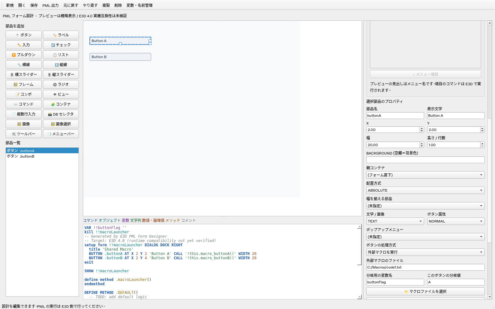

### PMLコードの色分け

生成PML、表示後プログラム、DEFAULT の追加処理、選択部品のメソッド処理、VIEW の追加PML、OPTION コマンドをコードエディタ風に色分けします。

| カテゴリ | 色 |
| --- | --- |
| コマンド・予約語 | 青 |
| オブジェクト名・現在のフォーム名 | 青緑 |
| グローバル・ローカル変数 | 紫 |
| 文字列・引用符で囲んだ値 | 緑 |
| 数値・TRUE / FALSE | 茶色 |
| メソッド | 黄土色 |
| VAL / DTEXT / RTEXT などのプロパティ | 灰青 |
| コメント | 灰緑 |

色の凡例を生成PML欄の上に表示します。色分けは表示だけに適用し、JSON・PMLの保存内容やUndoには影響しません。文字列内のコマンドや変数は文字列の色になります。`--`と`$*`の行コメント、`$(`〜`$)`のブロックコメント、3種類の引用符、複数行の文字列に対応します。名前管理で名前を変更すると現在のフォーム・部品名の認識も更新します。字句による色分けであり、PMLの実行や構文検証を行う機能ではありません。

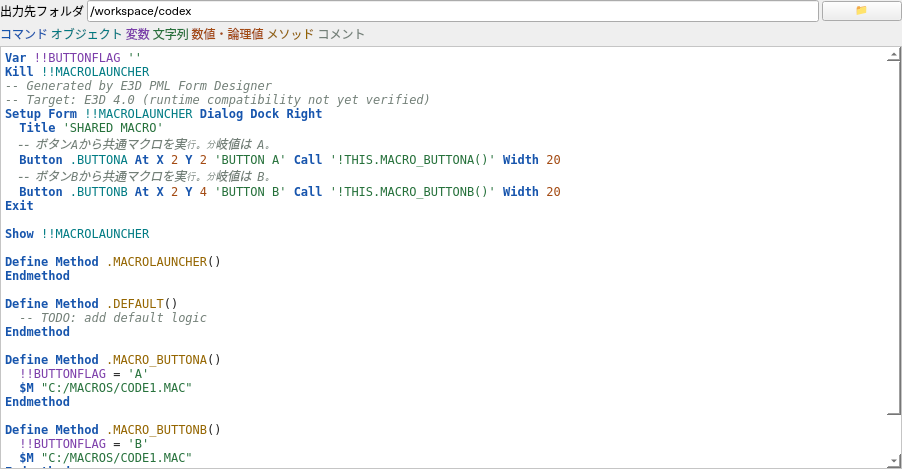

PMLファイルと分岐マクロのひな形は、SJIS（Windows拡張の CP932）・CRLF に固定して出力します。文字コードの選択欄はありません。編集用 JSON は UTF-8 のままです。CP932で表せない文字がある場合は出力を止め、既存ファイルを上書きしません。

### コードの大文字・小文字

自動生成するPMLのキーワードは先頭1文字を大文字に整えます。ユーザーが入力したオブジェクト名・変数名・メソッド名・表示名・値・コマンド・パスは入力どおりの大文字小文字で出力します。メソッド本文、DEFAULT本文、表示後のプログラム、ビューの処理も表記を変更しません。名前管理の「PML名」も実際の出力と同じ表記です。

```text
Var !!buttonFlag ''
Setup Form !!MyForm Dialog Dock Right
Button .RunButton At X 2 Y 3 'Run' Call 'SaVeWoRk' Width 14
Show !!MyForm
```

外部マクロの分岐値も入力どおり保持し、`modeA` と `ModeA` を別の値として扱います。E3D実機検証は未実施です。

### 出力フォルダと部品コメント

「MAC 出力」（Ctrl+E）は SJIS（CP932）・CRLF のテキストを `.mac` として保存します。拡張子を省略した場合や別の拡張子を指定した場合も `.mac` に統一します。

「コードを表示」で開く別ウィンドウに「出力先フォルダ」があります。初期値はアプリと同じフォルダ（exe版はexeのあるフォルダ、Python版は `run_designer.py` のあるフォルダ）です。フォルダ欄の入力を確定するか、📁ボタンで選ぶとアプリと同じフォルダの `settings.json` へUTF-8で保存し、次回起動時に読み込みます。空欄を確定すると初期フォルダへ戻ります。フォルダ設定は編集用の設計JSONとは別に管理し、部品のUndoには含めません。

各部品のプロパティに「部品のコメント」欄があります。複数行を入力でき、コードではその部品の定義直前に各行を `--` コメントとして付けます。コメントは設計JSONへ保存され、部品の複製・Undoにも対応します。コメントの大文字小文字は維持します。

### BACKGROUND の色番号表

BUTTON・PARAGRAPH・LIST を選び、「🎨 色番号表から選択」で1〜320の番号を選べます。番号の手入力も引き続き使えます。「背景色を指定しない」で BACKGROUND を省略します。選んだ番号は設計JSONに保存され、Undoにも対応します。

色見本はユーザー提供の写真を目視で参考にした近似色です。写真から正確なRGB値は取得しておらず、中間色は色相・明暗の傾向を補完しています。E3Dの正式なRGB対応表ではありません。プレビューの背景色と見やすい文字色に使用し、MACの出力には元の番号だけを記載します。実際の色はE3D側の色設定で決まります。表にない番号の手入力も既存どおり受け付けますが、プレビューは標準色になります。

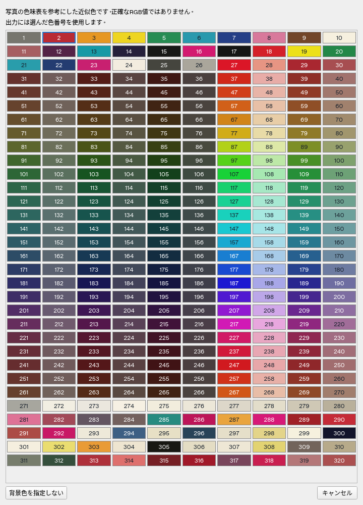

通常の部品名・フォーム名・メニュー名欄でも、名前管理と同じ処理で既知のコード参照を更新します。空欄・不正な名前・重複名は適用せず、入力を続けられます。参照更新と名前変更は同じUndoに含まれます。

画像の相対パスは、編集中の設計JSONのフォルダ、MACを取り込んだ場合はその元フォルダ、最後にアプリのフォルダから探してプレビューします。保存・MAC出力のパス文字列は保持します。JSONを別フォルダへ保存する場合は画像も配置するか、絶対パスを指定してください。

チェックボックス（TOGGLE）とラジオボタン（RTOGGLE）の初期値は、空欄・TRUE・FALSEのプルダウンから選びます。空欄は初期値設定を省略します。テキスト入力（TEXT）のプレビューは、枠の外の表示名と枠内の入力値を分けて表示し、文字列・数値の初期値は従来どおり入力できます。配置・サイズと出力するPMLの内容は維持しています。

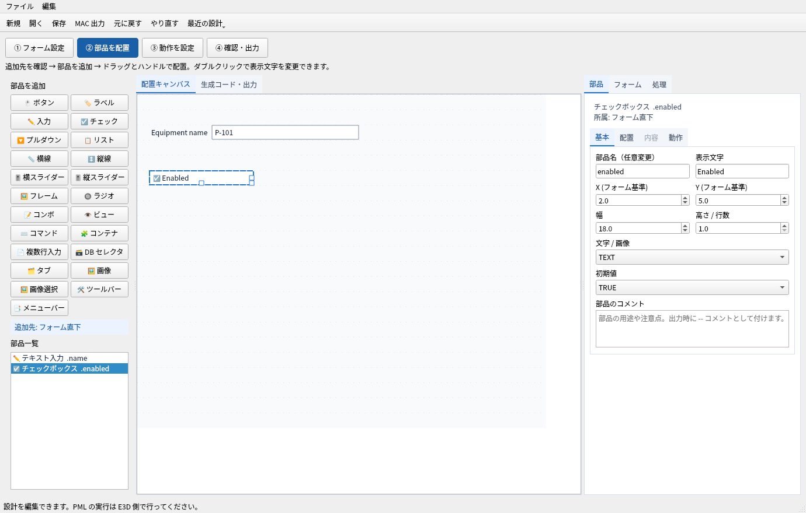
