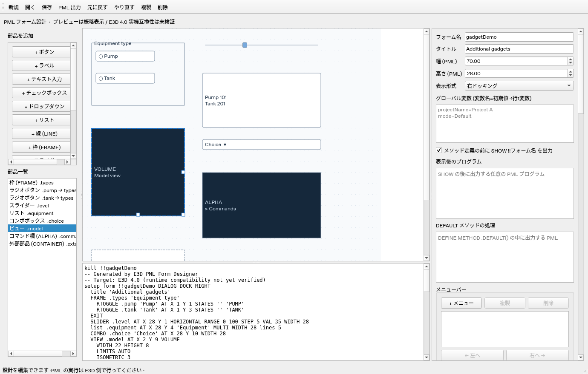
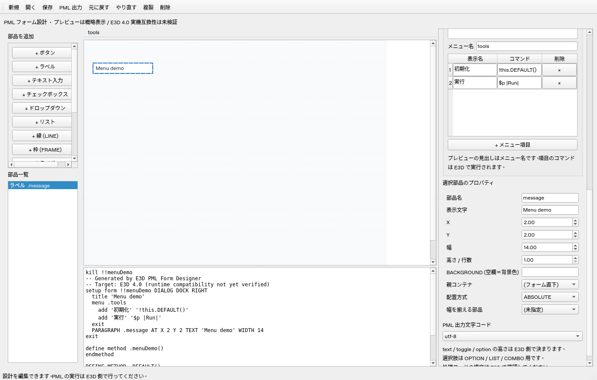

# E3D PML Form Designer

AVEVA E3D の PML ユーザーフォームを視覚的に設計する、日本語 UI の PySide6 デスクトップアプリです。E3D 4.0 を想定していますが、E3D 実機での構文・表示・文字コードの互換性は未検証です。E3D 本体やライセンスは含みません。

## UI



## 起動 (Windows)

Python 3.12 をインストールして、このディレクトリで実行します。

```powershell
py -3.12 -m venv .venv
.\.venv\Scripts\python.exe -m pip install -r requirements.txt
.\.venv\Scripts\python.exe -m e3d_designer
```

Linux では `python3 -m venv .venv`、`.venv/bin/python -m pip install -r requirements.txt`、`.venv/bin/python -m e3d_designer` を使用します。画面操作にはデスクトップ環境が必要です。

Windowsで `onedir` 形式のEXEを作成するコマンドは、同梱の [EXE_BUILD_ONEDIR.txt](EXE_BUILD_ONEDIR.txt) に記載しています。PyInstallerの起動ファイルには `run_designer.py` を使います。配布時は `dist/E3DFormDesigner` フォルダー全体を含めてください。

## 使い方

追加ボタンは絵文字付きの2列・8行で表示し、縦横のスクロールを使わず全16ボタンを選べます。線とスライダーは縦・横の専用ボタンを用意し、追加時に向きも設定します。ボタンにマウスを重ねると正式な部品名を表示します。

1. 左のボタンで部品を追加し、キャンバスをドラッグして配置します。選択した部品の右端・下端・右下のハンドルをドラッグすると、幅・高さ・両方を変更できます。
2. 右で部品名、表示文字、座標、サイズを変更します。数値は PML レイアウト単位です。
3. フォーム全体の名前・タイトル・サイズとグローバル変数を設定します。変数は `equipmentValue=P-101` のように1行1変数で記述します。
4. TEXT の型・初期値、OPTION / LIST の選択肢を指定します。OPTION のコマンド欄は選択肢と同じ行順です。
5. BUTTON / TEXT / TOGGLE に CALL コマンド、またはメソッド名を設定します。メソッド名を指定した場合はその処理コードを編集できます。両方は同時指定できません。
6. DEFAULT メソッドの処理と「表示後のプログラム」を必要に応じて記述します。
7. 「保存」で JSON 設計を保存し、「PML 出力」で `.pmlfrm` を生成します。UTF-8 / CP932 は E3D 側の設定に合わせて選択します。

サイズ変更は0.5 PML単位で、最小値は1です。親領域を超える変更や、FRAME内の子部品をはみ出させる縮小は受け付けません。参照先のサイズを変えると、相対配置・幅参照のプレビューも追従します。幅を参照している部品では高さのハンドルだけを表示します。ドラッグ1回をUndoで戻せます。高さなどがPML構文に含まれない部品では、変更はプレビュー用です。

左の部品一覧はドラッグで並べ替えできます。親コンテナは変わらず、同じ親に属する部品やタブページの順序が変わります。保存・Undo / Redoに対応します。PML出力時には参照先を先に出す規則も適用します。AUTOの基準は並べ替え後の同じ親の直前の部品になり、配置が成立しなければ出力エラーを表示します。

## タブと入れ子の FRAME

FRAME を追加し、「FRAME 形式」を TABSET に変更します。TABSET を選んで FRAME を追加するとタブページになり、その FRAME を選んで部品を追加するとページ内の部品になります。「親コンテナ」で既存部品の所属も変更できます。TABSET の直下には通常の FRAME のみ配置できます。

キャンバスのタブ見出しをクリックするか、左の部品一覧でページの FRAME またはその部品を選ぶとプレビューの表示ページを切り替えます。親を名前変更すると子の参照も更新し、親を複製・削除すると子もまとめて複製・削除します。Undo / Redo で戻せます。子の座標は親基準です。親子の循環、存在しない親、親領域を超える配置は出力時に検出します。

座標指定時の通常 FRAME の出力はユーザー指定の `FRAME .name '表示名'` で、キャンバスの座標・幅・高さは出力しません。このため実際の位置・寸法は E3D の自動レイアウトに依存し、プレビューと一致するとは限りません。

## メニューバー

右の「メニューバー」で「+ メニュー」を押し、メニュー名を指定します。「+ メニュー項目」で表示名とコマンドを追加します。各行の「操作」から上へ・下へ・複製・削除を選べます。メニュー全体も「複製」「削除」で編集し、「← 左へ」「右へ →」で表示順を変更できます。複製したメニューには重複しない名前を付けます。保存・読み込みと Undo / Redo に対応しています。名前は部品名と重複させません。

ユーザー提供の構文で、フォーム定義内に以下を出力します。

```pml
menu .tools
  add '初期化' '!this.DEFAULT()'
  add '実行' '$p |Run|'
exit
```

プレビューではメニュー名を見出しにして項目を表示します。コマンドはプレビューでは実行しません。見出しの表示名やフォームとの追加の関連付け構文は生成していません。E3D 実機での表示・動作は未検証です。サンプルは `examples/menus.json` / `examples/menus.pmlfrm` です。



## 生成する構文

ユーザー提供の構文を反映しています。

```pml
VAR !!equipmentValue 'P-101'
kill !!equipmenttool
setup form !!equipmenttool DIALOG DOCK RIGHT
  title 'Equipment Tool'
  FRAME .tabs TABSET AT X 2 Y 1 'TABSET' WIDTH 50
    FRAME .page1 'Settings'
      TEXT .equipmentName AT X 1 Y 1 'Name' WIDTH 20 IS STRING
      PARAGRAPH .message AT X 1 Y 3 TEXT 'Message' WIDTH 20
      TOGGLE .enabled AT X 1 Y 5 'Enabled' CALL '!this.onToggle()'
      BUTTON .run AT X 1 Y 7 BACKGROUND 5 'Run' CALL '!this.onRun()' WIDTH 12
      LINE .separator AT X 1 Y 9 '' HORIZ WIDTH 20 HEIGHT 1
      OPTION _mode AT X 1 Y 11 'Mode' CALL '$$_mode'
      VAR LIST _mode PAIRS
      'Mode A' 'COMMAND A'
      'Mode B' 'COMMAND B'
      EXIT
    EXIT
  EXIT
exit
```

BACKGROUND は PARAGRAPH / BUTTON / LIST に対応します。LIST では `list .name BACKGROUND 5 AT X 2 Y 3` のように AT より前に出力します。空欄なら省略します。PARAGRAPH は省略時に背景色になります。色番号は非負整数として出力し、色の対応や有効範囲は E3D で確認してください。プレビューでは BG 番号を表示します。

LINE は HORIZ / VERT を選択できます。表示文字は空文字に固定します。TEXT は STRING / REAL に対応します。TEXT / TOGGLE / OPTION の幅・高さや PARAGRAPH / BUTTON の高さなど、指定構文に含まれない寸法はプレビュー用です。LIST はユーザー指定の順序で `list .name AT X 値 Y 値 '表示名' SINGLE WIDTH 値 HEIGHT 値` と出力し、コンストラクタ内の `.dtext` を使用します。相対配置でも AT は表示名の前です。AUTO では AT を省略します。

OPTION は `_` 付きの名前を出力します。名前入力に `_` を付けても重複付与しません。選択肢のコマンドを空欄にすると空文字を出力します。コマンドの妥当性は E3D 側で確認してください。

## DEFAULT と表示後プログラム

「DEFAULT メソッドの処理」欄には外枠なしで、例えば次を入力します。

```pml
!!equipmenttool.equipmentName.VAL = !!equipmentValue
```

生成結果は次のようになります。

```pml
DEFINE METHOD .DEFAULT()
!!equipmenttool.equipmentName.VAL = !!equipmentValue
ENDMETHOD
```

フォーム定義の `exit` の後、すべての `DEFINE METHOD` より前に `SHOW !!equipmenttool` を出力します。「表示後のプログラム」は SHOW の直後、メソッド定義より前に追加します。DEFAULT は定義しただけでは自動呼び出ししません。呼び出す場合は表示後プログラムに `!!equipmenttool.DEFAULT()` と記述してください。サンプル `examples/equipmenttool.json` はその設定を含みます。SHOW の出力はチェックボックスで無効にできます。

## 検証と制約

```powershell
.\.venv\Scripts\python.exe -m unittest discover -s tests -v
```

ヘッドレス Linux は `QT_QPA_PLATFORM=offscreen` を指定します。GUI 起動、マウス移動、プロパティ編集、親子構造、ページ切替、履歴、保存・読込、PML 生成、文字コードエラーによる上書き防止を検証します。E3D ランタイムの検証ではありません。

プレビューの横幅・行高さは概略値で、フォント・DPI・tagwidth による描画までは再現しません。フォームサイズは 1〜300、部品は500個までです。表示文字列の `$` 展開は拒否し、CALL / PAIRS コマンド内では許可します。処理コードや表示後プログラムはそのまま出力し、PML 構文チェック・実行は行いません。安全な引用符を選べない文字列は出力を拒否します。

rtog・グリッド・PML.NET 部品、既存 PML のインポート、E3D との直接連携は未実装です。第三者ソースの転載は行っていません。調査元と互換性の注意点は [docs/research.md](docs/research.md) を参照してください。

## 監査後の修正

- 文字列の編集を入力時に反映し、フォーカスを移さず Ctrl+S しても最新の値を保存します。
- OPTION / LIST の改行とカーソル位置を保持します。選択肢より多い OPTION コマンドを入力しても削除せず、行数を揃えるまで出力エラーとして表示します。
- 設計ファイルのフィールド型を検証し、不正な処理コード・選択肢などを読込時に拒否します。
- 終了後の Scene 参照や遅延更新を抑止します。

追加調査: [PML の具体例・公開コードとの照合](docs/pml-examples-research.md)。ライフサイクル、イベント、OPTION、TABSET、型、ロード方式を整理しています。

### 相対配置・自動配置

右の「配置方式」で `ABSOLUTE`（座標）、`RELATIVE`（部品参照）、`AUTO`（直前の部品から自動配置）を選びます。

- `RELATIVE`: X/Y の参照部品と端（XMIN/XMAX、YMIN/YMAX）、オフセットを指定します。X の基準を RIGHT にすると自身の幅を引き、右端を合わせます。出力例: `AT XMAX.base-SIZE YMAX.base+0.5`。
- `AUTO`: PATH の DOWN/UP/LEFT/RIGHT、HALIGN の LEFT/CENTRE/RIGHT、VALIGN の TOP/CENTRE/BOTTOM、HDIST/VDIST の間隔を出力します。基準部品は部品一覧の同じ親に属する直前の部品です。
- 幅参照: `WIDTH.base` で参照先に幅を合わせます。TOGGLE / OPTION は未対応です。

参照方式ではドラッグと直接座標編集を無効にし、参照先の位置・幅を変えるとプレビューを追従させます。参照先の名前変更とコンテナ複製では参照名も更新します。参照先削除、別の親への参照、自身・循環参照は出力を止めます。参照先を先に出力しますが、この並べ替えで AUTO の基準が直前でなくなる場合はエラーにします。

相対配置の保存例は `examples/relative.json` / `examples/relative.pmlfrm` です。プレビューの寸法は概算で、通常 FRAME の自動寸法や E3D の文字幅によって実際の配置は変わります。出力構文は公開資料を参考にしていますが E3D 4.0 実機では未検証です。

## 追加ガジェット

`examples/gadgets.json` を開くと、追加部品をまとめて確認できます。PML のサンプルは `examples/gadgets.pmlfrm` です。右側には部品に関係するプロパティを表示します。

| 部品 | 設定・出力 |
| --- | --- |
| SLIDER | HORIZONTAL / VERTICAL、最小値・最大値・STEP・VAL。イベントメソッドは `(!gad is GADGET, !event is STRING)` を持つ open callback です。DEFAULT や通常部品と同じメソッド名は使えません。 |
| RTOGGLE | 通常 FRAME を選んで追加し、OFF / ON の実値を指定します。同じ FRAME 内をラジオグループとして出力します。選択状態は FRAME 側で管理されます。 |
| LIST | SINGLE / MULTIPLE の選択方式、単列の表示名 `.dtext`・実値 `.rtext`、複数列の SetHeadings / SetRows。 |
| COMBO | 編集可能な選択欄として定義します。公開例に合わせ、定義キーワードを COMBO / COMBOBOX から選べます。表示名と実値に対応します。 |
| VIEW | ALPHA / AREA / PLOT / VOLUME、幅・高さ、任意の ASPECT、内部の追加 PML。追加 PML には VIEW の外枠や EXIT を書きません。 |
| コマンド欄 | VIEW ALPHA として出力し、CHANNEL REQUESTS / COMMANDS を指定できます。 |
| CONTAINER | PMLNETCONTROL を出力します。アセンブリ・名前空間・型をすべて指定すると import、using namespace、保持用 member、生成と Control.handle 接続を出力します。 |

LIST / COMBO の実値は表示名と同じ行数で入力します。実値を空欄にすると `.rtext` を省略します。OPTION の実行コマンドとは別の設定で、実値をコマンドとして実行する処理は生成しません。

CONTAINER のアセンブリ・名前空間・型をすべて空欄にした場合は、Control 接続を DEFAULT などに記述してください。入力値に応じた外部 DLL は E3D 側で準備する必要があります。保持用メンバー名は `部品名Control` です。イベント購読や終了処理は用途に応じて記述してください。

キャンバスではスライダーの初期位置や部品の形を概略表示します。E3D のモデル描画、コマンド実行、外部 DLL の読み込みはプレビューでは実行しません。VIEW VOLUME のモデル表示には drawlist の作成・接続なども必要です。SLIDER の表示文字は出力されず、RTOGGLE / COMBO の高さなどはプレビュー用です。追加ガジェットの構文・イベントは E3D 4.0 実機での確認が必要です。構文の出典は [調査資料](docs/pml-examples-research.md) を参照してください。

## LIST の複数列

LIST を選び、「LIST 表示方式」を `TABLE` にすると表入力欄を表示します。先頭行に見出し、その下に各行のデータを入力します。「+ 列」「+ 行」で増やし、削除する列・行のセルを選んで「列削除」「行削除」で減らします。最後の1列と見出し行は残します。セルを編集中でも保存に反映し、Undo / Redo と複製に対応します。

`SINGLE` / `MULTIPLE` は行の単一選択・複数選択の設定で、列数とは独立です。`SIMPLE` に戻すと単列リストを使い、表データは保持します。TABLE では単列の `.dtext` / `.rtext` を出力せず、見出しと二次元の行配列を使います。

ユーザー提供の例に合わせ、TABLE の定義には `HEIGHT` を出力します。位置の AT は表示名の前、SHOW はすべてのメソッド定義より前です。設定メソッド名は編集可能で、空欄なら `populate_部品名` にします。コンストラクタからこのメソッドを呼びます。

```pml
define method .fillEquipment()
  !HEAD = ARRAY()
  !HEAD[1] = '番号'
  !HEAD[2] = '種類'
  !THIS.equipment.setheadings(!HEAD)
  !ROWS = ARRAY()
  !ROWS[1] = ARRAY()
  !ROWS[1][1] = 'P-101'
  !ROWS[1][2] = 'Pump'
  !ROWS[2] = ARRAY()
  !ROWS[2][1] = 'T-201'
  !ROWS[2][2] = 'Tank'
  !THIS.equipment.setrows(!ROWS)
endmethod
```

`!ROWS[行番号][列番号]` はどちらも1から始まります。SetRows は調査済みの公開資料を参考にしています。E3D 4.0 実機の構文・表示・選択動作は未検証です。サンプルは `examples/multicolumn.json` / `examples/multicolumn.pmlfrm` です。


単列 LIST の複数選択も、ユーザー提供の `MULTIPLE WIDTH 値 HEIGHT 値` に対応しています。表示名の配列をコンストラクタ内で作り、`!this.部品名.dtext = !choices` として代入します。`!choices` はローカル変数名で固定キーワードではありません。旧設計ファイルの `MULTI` は読み込み時に `MULTIPLE` へ置き換えます。

VIEW の「ASPECT (VIEW)」欄は空欄で省略、0より大きい有限数で指定します。出力は `WIDTH 30 HEIGHT 8 ASPECT 1.5` のように HEIGHT の直後です。キャンバスの枠サイズは WIDTH / HEIGHT に基づきます。ASPECT の E3D 側での表示への効果は実機で確認してください。

## 変数・オブジェクト名管理

キャンバスまたは部品一覧にフォーカスがあるとき、次のキーで選択部品を編集できます。

- `Delete`: 削除（フレームは子部品も削除）
- `Ctrl+C` / `Ctrl+V`: コピー / 貼り付け（フレームは子部品もコピー）
- `Ctrl+X`: 切り取り
- `Ctrl+Z`: 元に戻す

貼り付け時は部品名を重複しない名前に変更し、コピーした部品間の親・配置参照と、既知のコード表記の部品参照を更新します。位置はコピー元と同じなので、貼り付け直後は重なって表示されます。AUTO 配置はコピー時の座標による配置に変換します。別プロジェクトへの貼り付けで配置条件などが成立しない場合は、ステータスバーに理由を表示して変更を取り消します。貼り付け対象はこのエディタでコピーした部品です。文字入力欄では、これらのキーは通常の文字編集に使います。

ツールバーの「変数・名前管理」、または `Ctrl+M` で管理画面を開きます。

- 「グローバル変数」: `VAR !!名前 '初期値'` の変数を追加し、初期値と名前を変更できます。参照箇所を一覧に表示します。使用中の変数は、コードの参照を削除してから削除します。
- 「オブジェクト」: フォーム・部品・メニューの名前、実際のPML名、親、参照箇所を確認し、名前変更できます。OPTION の `_` 付きのPML名も表示します。
- 検索欄で名前・種類・親・参照先を絞り込めます。参照箇所の長い文字列はマウスを重ねて確認できます。

管理画面内で編集し、「適用」でプロジェクトへ反映します。未適用の変更は「閉じる」で破棄します。適用1回をメイン画面のUndoで戻せます。ファイル保存はメイン画面の「保存」で行います。

親、X/Yの相対配置、幅参照は名前変更に合わせて常に更新します。「コード内の参照も更新」が有効なら、DEFAULT、表示後プログラム、部品のCALL・処理コード・VIEWコード、OPTIONコマンド、メニューコマンドにある `!!変数` / `!!フォーム` / `!THIS.部品` / `!!フォーム.部品` も更新します。識別子の境界を確認し、`part` の変更で `partMore` は変更しません。CONTAINERの生成メンバー名と複数列LISTの自動メソッド名も追従します。

コード更新はPML全体の構文解析ではなく、既知の参照表記を対象にした置換です。同じ表記がコメントやコールバック文字列にある場合も更新します。文字列を連結して作る名前、別のローカル変数からの参照などは自動更新できません。チェックを外す場合はコード内の参照を手動で修正してください。管理対象の変数は現在グローバルVARです。生成するHEAD・ROWSなどのローカル変数名と、メソッド名・外部DLLの型名はこの一覧では変更しません。


