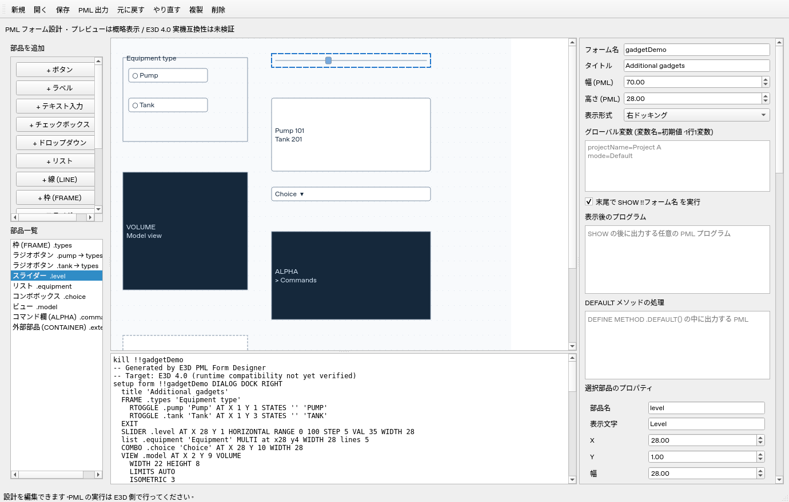

# E3D PML Form Designer

AVEVA E3D の PML ユーザーフォームを視覚的に設計する、日本語 UI の PySide6 デスクトップアプリです。E3D 4.0 を想定していますが、E3D 実機での構文・表示・文字コードの互換性は未検証です。E3D 本体やライセンスは含みません。

## UI



## 起動 (Windows)

Python 3.12 をインストールして、このディレクトリで実行します。

```powershell
py -3.12 -m venv .venv
.\.venv\Scripts\python.exe -m pip install -r requirements.txt
.\.venv\Scripts\python.exe -m e3d_designer
```

Linux では `python3 -m venv .venv`、`.venv/bin/python -m pip install -r requirements.txt`、`.venv/bin/python -m e3d_designer` を使用します。画面操作にはデスクトップ環境が必要です。

## 使い方

1. 左のボタンで部品を追加し、キャンバスをドラッグして配置します。
2. 右で部品名、表示文字、座標、サイズを変更します。数値は PML レイアウト単位です。
3. フォーム全体の名前・タイトル・サイズとグローバル変数を設定します。変数は `equipmentValue=P-101` のように1行1変数で記述します。
4. TEXT の型・初期値、OPTION / LIST の選択肢を指定します。OPTION のコマンド欄は選択肢と同じ行順です。
5. BUTTON / TEXT / TOGGLE に CALL コマンド、またはメソッド名を設定します。メソッド名を指定した場合はその処理コードを編集できます。両方は同時指定できません。
6. DEFAULT メソッドの処理と「表示後のプログラム」を必要に応じて記述します。
7. 「保存」で JSON 設計を保存し、「PML 出力」で `.pmlfrm` を生成します。UTF-8 / CP932 は E3D 側の設定に合わせて選択します。

## タブと入れ子の FRAME

FRAME を追加し、「FRAME 形式」を TABSET に変更します。TABSET を選んで FRAME を追加するとタブページになり、その FRAME を選んで部品を追加するとページ内の部品になります。「親コンテナ」で既存部品の所属も変更できます。TABSET の直下には通常の FRAME のみ配置できます。

キャンバスのタブ見出しをクリックするか、左の部品一覧でページの FRAME またはその部品を選ぶとプレビューの表示ページを切り替えます。親を名前変更すると子の参照も更新し、親を複製・削除すると子もまとめて複製・削除します。Undo / Redo で戻せます。子の座標は親基準です。親子の循環、存在しない親、親領域を超える配置は出力時に検出します。

座標指定時の通常 FRAME の出力はユーザー指定の `FRAME .name '表示名'` で、キャンバスの座標・幅・高さは出力しません。このため実際の位置・寸法は E3D の自動レイアウトに依存し、プレビューと一致するとは限りません。

## 生成する構文

ユーザー提供の構文を反映しています。

```pml
VAR !!equipmentValue 'P-101'
kill !!equipmenttool
setup form !!equipmenttool DIALOG DOCK RIGHT
  title 'Equipment Tool'
  FRAME .tabs TABSET AT X 2 Y 1 'TABSET' WIDTH 50
    FRAME .page1 'Settings'
      TEXT .equipmentName AT X 1 Y 1 'Name' WIDTH 20 IS STRING
      PARAGRAPH .message AT X 1 Y 3 TEXT 'Message' WIDTH 20
      TOGGLE .enabled AT X 1 Y 5 'Enabled' CALL '!this.onToggle()'
      BUTTON .run AT X 1 Y 7 BACKGROUND 5 'Run' CALL '!this.onRun()' WIDTH 12
      LINE .separator AT X 1 Y 9 '' HORIZ WIDTH 20 HEIGHT 1
      OPTION _mode AT X 1 Y 11 'Mode' CALL '$$_mode'
      VAR LIST _mode PAIRS
      'Mode A' 'COMMAND A'
      'Mode B' 'COMMAND B'
      EXIT
    EXIT
  EXIT
exit
```

BACKGROUND は PARAGRAPH / BUTTON に対応します。空欄なら省略します。PARAGRAPH は省略時に背景色になります。色番号は非負整数として出力し、色の対応や有効範囲は E3D で確認してください。プレビューでは BG 番号を表示します。

LINE は HORIZ / VERT を選択できます。表示文字は空文字に固定します。TEXT は STRING / REAL に対応します。TEXT / TOGGLE / OPTION の幅・高さや PARAGRAPH / BUTTON の高さなど、指定構文に含まれない寸法はプレビュー用です。LIST は公開実例の `list .name '表示名' at x値 y値 width 値 lines 行数` と、コンストラクタ内の `.dtext` を使用します。

OPTION は `_` 付きの名前を出力します。名前入力に `_` を付けても重複付与しません。選択肢のコマンドを空欄にすると空文字を出力します。コマンドの妥当性は E3D 側で確認してください。

## DEFAULT と表示後プログラム

「DEFAULT メソッドの処理」欄には外枠なしで、例えば次を入力します。

```pml
!!equipmenttool.equipmentName.VAL = !!equipmentValue
```

生成結果は次のようになります。

```pml
DEFINE METHOD .DEFAULT()
!!equipmenttool.equipmentName.VAL = !!equipmentValue
ENDMETHOD
```

メソッド定義の後に `SHOW !!equipmenttool` を出力し、その後に「表示後のプログラム」を追加します。DEFAULT は定義しただけでは自動呼び出ししません。呼び出す場合は表示後プログラムに `!!equipmenttool.DEFAULT()` と記述してください。サンプル `examples/equipmenttool.json` はその設定を含みます。SHOW の出力はチェックボックスで無効にできます。

## 検証と制約

```powershell
.\.venv\Scripts\python.exe -m unittest discover -s tests -v
```

ヘッドレス Linux は `QT_QPA_PLATFORM=offscreen` を指定します。GUI 起動、マウス移動、プロパティ編集、親子構造、ページ切替、履歴、保存・読込、PML 生成、文字コードエラーによる上書き防止を検証します。E3D ランタイムの検証ではありません。

プレビューの横幅・行高さは概略値で、フォント・DPI・tagwidth による描画までは再現しません。フォームサイズは 1〜300、部品は500個までです。表示文字列の `$` 展開は拒否し、CALL / PAIRS コマンド内では許可します。処理コードや表示後プログラムはそのまま出力し、PML 構文チェック・実行は行いません。安全な引用符を選べない文字列は出力を拒否します。

rtog・グリッド・PML.NET 部品、既存 PML のインポート、E3D との直接連携は未実装です。第三者ソースの転載は行っていません。調査元と互換性の注意点は [docs/research.md](docs/research.md) を参照してください。

## 監査後の修正

- 文字列の編集を入力時に反映し、フォーカスを移さず Ctrl+S しても最新の値を保存します。
- OPTION / LIST の改行とカーソル位置を保持します。選択肢より多い OPTION コマンドを入力しても削除せず、行数を揃えるまで出力エラーとして表示します。
- 設計ファイルのフィールド型を検証し、不正な処理コード・選択肢などを読込時に拒否します。
- 終了後の Scene 参照や遅延更新を抑止します。

追加調査: [PML の具体例・公開コードとの照合](docs/pml-examples-research.md)。ライフサイクル、イベント、OPTION、TABSET、型、ロード方式を整理しています。

### 相対配置・自動配置

右の「配置方式」で `ABSOLUTE`（座標）、`RELATIVE`（部品参照）、`AUTO`（直前の部品から自動配置）を選びます。

- `RELATIVE`: X/Y の参照部品と端（XMIN/XMAX、YMIN/YMAX）、オフセットを指定します。X の基準を RIGHT にすると自身の幅を引き、右端を合わせます。出力例: `AT XMAX.base-SIZE YMAX.base+0.5`。
- `AUTO`: PATH の DOWN/UP/LEFT/RIGHT、HALIGN の LEFT/CENTRE/RIGHT、VALIGN の TOP/CENTRE/BOTTOM、HDIST/VDIST の間隔を出力します。基準部品は部品一覧の同じ親に属する直前の部品です。
- 幅参照: `WIDTH.base` で参照先に幅を合わせます。TOGGLE / OPTION は未対応です。

参照方式ではドラッグと直接座標編集を無効にし、参照先の位置・幅を変えるとプレビューを追従させます。参照先の名前変更とコンテナ複製では参照名も更新します。参照先削除、別の親への参照、自身・循環参照は出力を止めます。参照先を先に出力しますが、この並べ替えで AUTO の基準が直前でなくなる場合はエラーにします。

相対配置の保存例は `examples/relative.json` / `examples/relative.pmlfrm` です。プレビューの寸法は概算で、通常 FRAME の自動寸法や E3D の文字幅によって実際の配置は変わります。出力構文は公開資料を参考にしていますが E3D 4.0 実機では未検証です。

## 追加ガジェット

`examples/gadgets.json` を開くと、追加部品をまとめて確認できます。PML のサンプルは `examples/gadgets.pmlfrm` です。右側には部品に関係するプロパティを表示します。

| 部品 | 設定・出力 |
| --- | --- |
| SLIDER | HORIZONTAL / VERTICAL、最小値・最大値・STEP・VAL。イベントメソッドは `(!gad is GADGET, !event is STRING)` を持つ open callback です。DEFAULT や通常部品と同じメソッド名は使えません。 |
| RTOGGLE | 通常 FRAME を選んで追加し、OFF / ON の実値を指定します。同じ FRAME 内をラジオグループとして出力します。選択状態は FRAME 側で管理されます。 |
| LIST | SINGLE / MULTI の選択方式、表示名 `.dtext`、実値 `.rtext`。複数列は未対応です。 |
| COMBO | 編集可能な選択欄として定義します。公開例に合わせ、定義キーワードを COMBO / COMBOBOX から選べます。表示名と実値に対応します。 |
| VIEW | ALPHA / AREA / PLOT / VOLUME、幅・高さ、内部の追加 PML。追加 PML には VIEW の外枠や EXIT を書きません。 |
| コマンド欄 | VIEW ALPHA として出力し、CHANNEL REQUESTS / COMMANDS を指定できます。 |
| CONTAINER | PMLNETCONTROL を出力します。アセンブリ・名前空間・型をすべて指定すると import、using namespace、保持用 member、生成と Control.handle 接続を出力します。 |

LIST / COMBO の実値は表示名と同じ行数で入力します。実値を空欄にすると `.rtext` を省略します。OPTION の実行コマンドとは別の設定で、実値をコマンドとして実行する処理は生成しません。

CONTAINER のアセンブリ・名前空間・型をすべて空欄にした場合は、Control 接続を DEFAULT などに記述してください。入力値に応じた外部 DLL は E3D 側で準備する必要があります。保持用メンバー名は `部品名Control` です。イベント購読や終了処理は用途に応じて記述してください。

キャンバスではスライダーの初期位置や部品の形を概略表示します。E3D のモデル描画、コマンド実行、外部 DLL の読み込みはプレビューでは実行しません。VIEW VOLUME のモデル表示には drawlist の作成・接続なども必要です。SLIDER の表示文字は出力されず、RTOGGLE / COMBO の高さなどはプレビュー用です。追加ガジェットの構文・イベントは E3D 4.0 実機での確認が必要です。構文の出典は [調査資料](docs/pml-examples-research.md) を参照してください。
