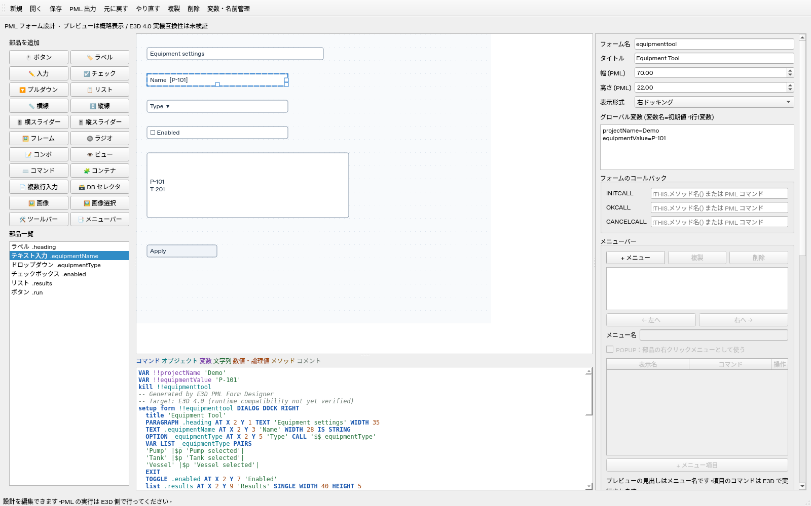
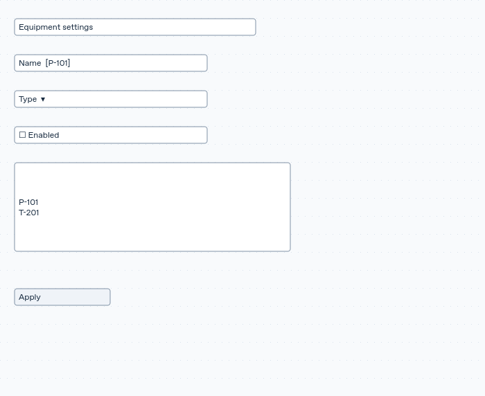
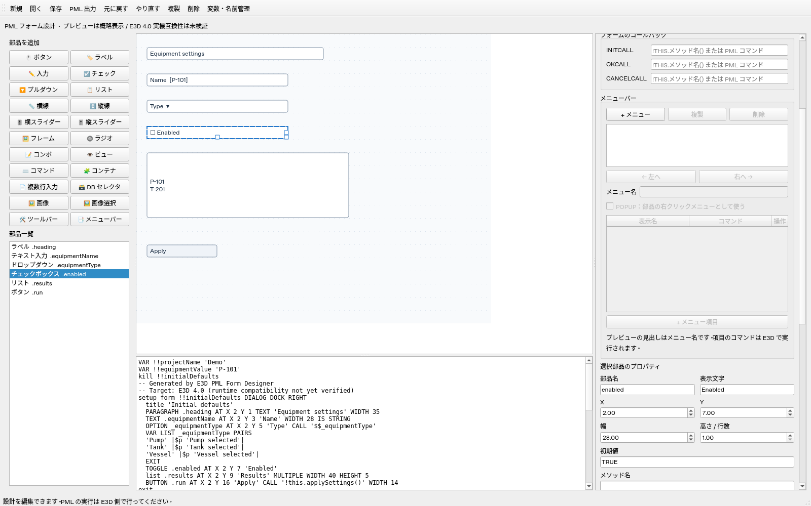
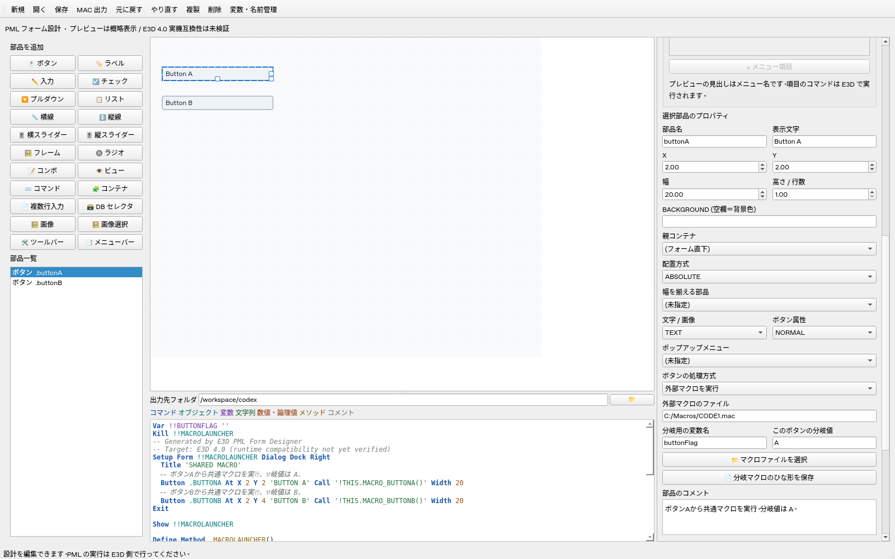

# 最新UI

追加ボタンは指定の2行の順序へ変更しました。FRAMEの右クリックで「子を含めてすべて選択」を選ぶと、入れ子の部品もツリーとキャンバスで選択します。複数選択中は右側を灰色にして編集を無効にします。

- [子を含めた複数選択](multiple-selection.png)
- [指定のボタン順とメニューバー](grouped-palette.png)
- [元画像のサイズ固定と1行TEXT](fixed-dimensions.png)：画像の幅・高さは元寸法で読み取り専用、画像にはサイズ変更ハンドルを表示しません。
- [線・スライダーの太さ固定](fixed-thickness.png)：長さだけにサイズ変更ハンドルを表示します。文字PARAGRAPHは高さ1行に固定します。
- [向き変更のミニ編集](directional-editor.png)：横／縦を切り替えると長さを引き継ぎ、太さを固定値へ戻します。

上部の作業順ボタンとキャンバス／コード切り替えタブを撤去しました。部品ボタン・キャンバス・プロパティは常時表示し、コードは「コードを表示」で別ウィンドウに開きます。

- [メイン編集画面](form-canvas.png)
- [コードの別ウィンドウ](separate-code.png)

過去のworkflow-*.pngは以前の画面の記録です。

[初期値のプルダウンとテキスト入力の表示](initial-preview.png)では、TRUE/FALSEの選択欄と、枠外の表示名・枠内の値を確認できます。

以下は過去の画面例です。

---

# 現在のUIと配置サンプル

最新の編集画面は [仕上げ後の画面](finished-editor.png) です。別名保存・コンパクトな部品設定・追加先表示を確認できます。

以下の過去の画面例は、PySide6アプリで `examples/equipmenttool.json` を開いて撮影した画面です。

- [エディタ全体](editor.png)
- [配置したフォームのプレビュー](equipmenttool-preview.png)
- [対応する生成PMLコード](equipmenttool.mac)
- [編集用JSON](../../examples/equipmenttool.json)

プレビューはエディタでの概略表示です。E3D実機の画面ではありません。

初期値をプロパティから設定した例です。初期設定コードは DEFAULT メソッドへ自動生成します。

[編集用JSON](../../examples/initial-defaults.json) / [生成PML](../../examples/initial-defaults.mac)

[外部マクロを呼び出すサンプル](../../examples/macro-launcher.json) / [分岐マクロのひな形](../../examples/macro-code1.mac)

最新のフォーム枠・ハンドル・共通プロパティ: [form-canvas.png](form-canvas.png)。フォームタブは廃止し、選択に合わせてプロパティを表示します。

左側のツリーと上部の追加ボタン: [tree-explorer.png](tree-explorer.png)。FRAMEとタブのフレームをフォルダとして展開できます。
